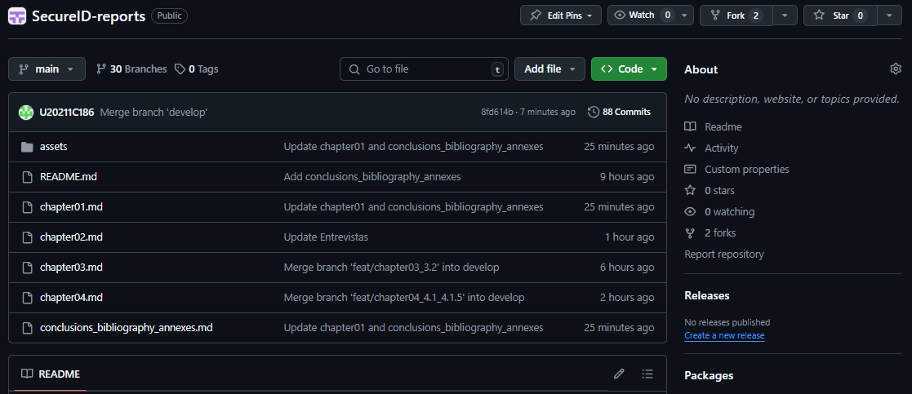

### Universidad Peruana de Ciencias Aplicadas
### SI728 | WX83 | Arquitecturas De Software Emergentes
### Profesor: Royer Edelwer Rojas Malasquez
### Ingeniería de Software
.
# SecureID
### TB1 REPORT - IDBlock
================================
#### Team members
- Pastrana León, Aldo Francisco (U20211C186)
- Ore Aleman, Anderson Raul (U202011467)
- Sabino Arostegui, Max Dayson (U20201A991)
- Hernandez Tuesta, Sebastian  (U20171B498)
- López Takahashi, Rodrigo Andrés (U201615003)

#### Ciclo 2024-02

---
# Registro de Versiones del Informe
| 
Versión
 | 
Fecha
 | 
Autor
 | Descripción de modificación |
|:---------:|:-------:|:-------:|-----------------------------|
| **v1.1** | 30-08-2024 | IDBlock | Para esta versión, hemos priorizado los capítulos que abordan directamente la startup, el problema a resolver y el producto que se planea desarrollar. Además, hemos definido con mayor claridad los segmentos objetivos y hemos llevado a cabo un proceso de investigación para identificar las necesidades del mercado, conocido como "needfinding". |
| **v1.2** | 04-09-2024 | IDBlock | Para esta versión, hemos procedido a actualizar los user persona centrándonos en los resultados de nuestras entrevistas. Además, el equipo llevó a cabo una sesión de "event storming" con el fin de definir el dominio y los contextos acotados de nuestra solución. |
| **v1.3** | 25-09-2024 | IDBlock | Para esta versión, hemos desarrollado la arquitectura de software utilizando diagramas de contexto y contenedores. Además, hemos llevado a cabo una exhaustiva verificación de errores y hemos actualizado puntos previamente identificados. |
| **v2.1** | 25-09-2024 | IDBlock | Para esta versión, hemos realizado correciones en puntos como el Lean UX, entrevistas y EventStorming guiándonos del feedback que nos dió el profesor. Además, hemos verificado y corregido diversos errores. |

---
# Project Report Collaboration Insights

**Project Report**

Link: https://github.com/IDBlock-WX83/SecureID-reports

TB1: El equipo ha abordado con éxito los puntos requeridos para la entrega solicitada. Durante el proceso de adaptación al entorno documental, nos enfrentamos a algunos desafíos al estructurar y convertir el archivo. Sin embargo, a pesar de estos contratiempos, nos complace informar que logramos alcanzar los objetivos establecidos.

TP: En el marco de la segunda entrega, el equipo ha consolidado una mayor destreza en la elaboración del informe mediante el uso de Markdown, capitalizando la versatilidad de esta interfaz para integrar código HTML. Nos complace informar que hemos cumplido de manera integral con los puntos requeridos en el entregable. Además, es importante destacar que se ha registrado un progreso sustancial tanto en la optimización de la página de inicio como en el desarrollo de la aplicación web.

> Analíticos para el TB1

> Analíticos para el TP1

---
# Contenido
- [Capítulo I: Introducción](/chapter01.md#capítulo-i-introducción)
  - [1.1. Startup Profile](/chapter01.md#11-startup-profile)
    - [1.1.1. Descripción de la Startup](/chapter01.md#111-descripción-de-la-startup)
    - [1.1.2. Perfiles de integrantes del equipo](/chapter01.md#112-perfiles-de-integrantes-del-equipo)
  - [1.2. Solution Profile](/chapter01.md#12-solution-profile)
    - [1.2.1 Antecedentes y problemática](/chapter01.md#121-antecedentes-y-problemática)
    - [1.2.2 Lean UX Process](/chapter01.md#122-lean-ux-process)
      - [1.2.2.1. Lean UX Problem Statements](/chapter01.md#1221-lean-ux-problem-statements)
      - [1.2.2.2. Lean UX Assumptions](/chapter01.md#1222-lean-ux-assumptions)
      - [1.2.2.3. Lean UX Hypothesis Statements](/chapter01.md#1223-lean-ux-hypothesis-statements)
      - [1.2.2.4. Lean UX Canvas](/chapter01.md#1224-lean-ux-canvas)
  - [1.3. Segmentos objetivo](/chapter01.md#13-segmentos-objetivo)
- [Capítulo II: Requirements Elicitation \& Analysis](/chapter02.md#capítulo-ii-requirements-elicitation--analysis)
  - [2.1. Competidores](/chapter02.md#21-competidores)
    - [2.1.1. Análisis competitivo](/chapter02.md#211-análisis-competitivo)
    - [2.1.2. Estrategias y tácticas frente a competidores](/chapter02.md#212-estrategias-y-tácticas-frente-a-competidores)
  - [2.2. Entrevistas](/chapter02.md#22-entrevistas)
    - [2.2.1. Diseño de entrevistas](/chapter02.md#221-diseño-de-entrevistas)
    - [2.2.2. Registro de entrevistas](/chapter02.md#222-registro-de-entrevistas)
    - [2.2.3. Análisis de entrevistas](/chapter02.md#223-análisis-de-entrevistas)
  - [2.3. Needfinding](/chapter02.md#23-needfinding)
    - [2.3.1. User Personas](/chapter02.md#231-user-personas)
    - [2.3.2. User Task Matrix](/chapter02.md#232-user-task-matrix)
    - [2.3.3. Empathy Mapping](/chapter02.md#233-empathy-mapping)
    - [2.3.4. As-is Scenario Mapping](/chapter02.md#234-as-is-scenario-mapping)
  - [2.4. Ubiquitous Language](/chapter02.md#24-ubiquitous-language)
- [Capítulo III: Requirements Specification](/chapter03.md#capítulo-iii-requirements-specification)
  - [3.1. To-Be Scenario Mapping](/chapter03.md#31-to-be-scenario-mapping)
  - [3.2. User Stories](/chapter03.md#32-user-stories)
  - [3.3. Impact Mapping](/chapter03.md#33-impact-mapping)
  - [3.4. Product Backlog](/chapter03.md#34-product-backlog)
- [Capítulo IV: Strategic-Level Software Design](/chapter04.md#capítulo-iv-strategic-level-software-design)
  - [4.1. Strategic-Level Attribute-Driven Design](/chapter04.md#41-strategic-level-attribute-driven-design)
    - [4.1.1. Design Purpose](/chapter04.md#411-design-purpose)
    - [4.1.2. Attribute-Driven Design Inputs](/chapter04.md#412-attribute-driven-design-inputs)
      - [4.1.2.1 Primary Functionality (Primary User Stories)](/chapter04.md#4121-primary-functionality-primary-user-stories)
      - [4.1.2.2 Quality attribute Scenarios](/chapter04.md#4122-quality-attribute-scenarios)
      - [4.1.2.3 Constraints](/chapter04.md#4123-constraints)
    - [4.1.3. Architectural Drivers Backlog](/chapter04.md#413-architectural-drivers-backlog)
    - [4.1.4. Architectural Design Decisions](/chapter04.md#414-architectural-design-decisions)
    - [4.1.5. Quality Attribute Scenario Refinements](/chapter04.md#415-quality-attribute-scenario-refinements)
  - [4.2. Strategic-Level Domain-Driven Design](/chapter04.md#41-strategic-level-domain-driven-design)
    - [4.2.1. EventStorming](/chapter04.md#421-eventStorming)
    - [4.2.2. Candidate Context Discovery](/chapter04.md#422-candidate-context-discovery)
    - [4.2.3. Domain Message Flows Modeling](/chapter04.md#423-domain-message-flows-modeling)
    - [4.2.4. Bounded Context Canvases](/chapter04.md#424-bounded-context-canvases)
    - [4.2.5. Context Mapping](/chapter04.md#425-context-mapping)
  - [4.3. Software Architecture](/chapter04.md#43-software-architecture)
    - [4.3.1. Software Architecture System Landscape Diagram](/chapter04.md#431-software-architecture-system-landscape-diagram)
    - [4.3.2. Software Architecture Context Level Diagrams](/chapter04.md#432-software-architecture-context-level-diagrams)
    - [4.3.3. Software Architecture Container Level Diagrams](/chapter04.md#433-software-architecture-container-level-diagrams)
    - [4.3.4. Software Architecture Deployment Diagrams](/chapter04.md#434-software-architecture-deployment-diagrams)
- [Capítulo V: Tactical-Level Software Design](/chapter05.md#capítulo-v-solution-software-design)
 - [5.1. Bounded Context: Profile Management](/chapter05.md#421-bounded-context-account)
      - [5.1.1. Domain Layer](/chapter05.md#4211-domain-layer)
      - [5.1.2. Interface Layer](/chapter05.md#4212-interface-layer)
      - [5.1.3. Application Layer](/chapter05.md#4213-application-layer)
      - [5.1.4. Infrastructure Layer](/chapter05.md#4214-infrastructure-layer)
      - [5.1.5. Bounded Context Software Architecture Component Level Diagrams](/chapter05.md#4215-bounded-context-software-architecture-component-level-diagrams)
      - [5.1.6. Bounded Context Software Architecture Code Level Diagrams](/chapter05.md#4216-bounded-context-software-architecture-code-level-diagrams)
        - [5.1.6.1. Bounded Context Domain Layer Class Diagrams](/chapter05.md#42161-bounded-context-domain-layer-class-diagrams)
        - [5.1.6.2. Bounded Context Database Design Diagram](/chapter05.md#42162-bounded-context-database-design-diagram)
    - [5.2. Bounded Context: Identity Verification](/chapter05.md#422-bounded-context-inventory)
      - [5.2.1. Domain Layer](/chapter05.md#4221-domain-layer)
      - [5.2.2. Interface Layer](/chapter05.md#4222-interface-layer)
      - [5.2.3. Application Layer](/chapter05.md#4223-application-layer)
      - [5.2.4. Infrastructure Layer](/chapter05.md#4224-infrastructure-layer)
      - [5.2.5. Bounded Context Software Architecture Component Level Diagrams](/chapter05.md#4225-bounded-context-software-architecture-component-level-diagrams)
      - [5.2.6. Bounded Context Software Architecture Code Level Diagrams](/chapter05.md#4226-bounded-context-software-architecture-code-level-diagrams)
        - [5.2.6.1. Bounded Context Domain Layer Class Diagrams](/chapter05.md#42261-bounded-context-domain-layer-class-diagrams)
        - [5.2.6.2. Bounded Context Database Design Diagram](/chapter05.md#42262-bounded-context-database-design-diagram)
    - [5.3. Bounded Context: Service Access Management](/chapter05.md#423-bounded-context-flowerpot)
      - [5.3.1. Domain Layer](/chapter05.md#4231-domain-layer)
      - [5.3.2. Interface Layer](/chapter05.md#4232-interface-layer)
      - [5.3.3. Application Layer](/chapter05.md#4233-application-layer)
      - [5.3.4. Infrastructure Layer](/chapter05.md#4234-infrastructure-layer)
      - [5.3.5. Bounded Context Software Architecture Component Level Diagrams](/chapter05.md#4235-bounded-context-software-architecture-component-level-diagrams)
      - [5.3.6. Bounded Context Software Architecture Code Level Diagrams](/chapter05.md#4236-bounded-context-software-architecture-code-level-diagrams)
        - [5.3.6.1. Bounded Context Domain Layer Class Diagrams](/chapter05.md#42361-bounded-context-domain-layer-class-diagrams)
        - [5.3.6.2 Bounded Context Database Design Diagram](/chapter05.md#42362-bounded-context-database-design-diagram)
    - [5.4. Bounded Context: Audit and Security Context](/chapter05.md#424-bounded-context-claim)
      - [5.4.1. Domain Layer](/chapter05.md#4241-domain-layer)
      - [5.4.2. Interface Layer](/chapter05.md#4242-interface-layer)
      - [5.4.3. Application Layer](/chapter05.md#4243-application-layer)
      - [5.4.4. Infrastructure Layer](/chapter05.md#4244-infrastructure-layer)
      - [5.4.5. Bounded Context Software Architecture Component Level Diagrams](/chapter05.md#4245-bounded-context-software-architecture-component-level-diagrams)
      - [5.4.6. Bounded Context Software Architecture Code Level Diagrams](/chapter05.md#4246-bounded-context-software-architecture-code-level-diagrams)
        - [5.4.6.1. Bounded Context Domain Layer Class Diagrams](/chapter05.md#42461-bounded-context-domain-layer-class-diagrams)
        - [5.4.6.2. Bounded Context Database Design Diagram](/chapter05.md#42462-bounded-context-database-design-diagram)
    - [5.5. Bounded Context: Government Integration Context](/chapter05.md#425-bounded-context-iot-solution)
      - [5.5.1. Domain Layer](/chapter05.md#4251-domain-layer)
      - [5.5.2. Interface Layer](/chapter05.md#4252-interface-layer)
      - [5.5.3. Application Layer](/chapter05.md#4253-application-layer)
      - [5.5.4. Infrastructure Layer](/chapter05.md#4254-infrastructure-layer)
      - [5.5.5. Bounded Context Software Architecture Component Level Diagrams](/chapter05.md#4255-bounded-context-software-architecture-component-level-diagrams)
      - [5.5.6. Bounded Context Software Architecture Code Level Diagrams](/chapter05.md#4256-bounded-context-software-architecture-code-level-diagrams)
        - [5.5.6.1. Bounded Context Domain Layer Class Diagrams](/chapter05.md#42561-bounded-context-domain-layer-class-diagrams)
        - [5.5.6.2. Bounded Context Database Design Diagram](/chapter05.md#42562-bounded-context-database-design-diagram) 
    - [5.6. Bounded Context: Blockchain Management Context](/chapter05.md#425-bounded-context-iot-solution)
      - [5.6.1. Domain Layer](/chapter05.md#4251-domain-layer)
      - [5.6.2. Interface Layer](/chapter05.md#4252-interface-layer)
      - [5.6.3. Application Layer](/chapter05.md#4253-application-layer)
      - [5.6.4. Infrastructure Layer](/chapter05.md#4254-infrastructure-layer)
      - [5.6.5. Bounded Context Software Architecture Component Level Diagrams](/chapter05.md#4255-bounded-context-software-architecture-component-level-diagrams)
      - [5.6.6. Bounded Context Software Architecture Code Level Diagrams](/chapter05.md#4256-bounded-context-software-architecture-code-level-diagrams)
        - [5.6.6.1. Bounded Context Domain Layer Class Diagrams](/chapter05.md#42561-bounded-context-domain-layer-class-diagrams)
        - [5.6.6.2. Bounded Context Database Design Diagram](/chapter05.md#42562-bounded-context-database-design-diagram)      
- [Capítulo VI: Solution UI/UX Design](/chapter06.md#capítulo-v-solution-uiux-design)
  - [6.1. Style Guidelines](/chapter06.md#51-style-guidelines)
    - [6.1.1. General Style Guidelines](/chapter06.md#511-general-style-guidelines)
    - [6.1.2. Web, Mobile and IoT Style Guidelines](/chapter06.md#512-web-mobile-and-iot-style-guidelines)
  - [6.2. Information Architecture](/chapter06.md#52-information-architecture)
    - [6.2.1. Organization Systems](/chapter06.md#521-organization-systems)
    - [6.2.2. Labeling Systems](/chapter06.md#522-labeling-systems)
    - [6.2.3. SEO Tags and Meta Tags](/chapter06.md#523-seo-tags-and-meta-tags)
    - [6.2.4. Searching Systems](/chapter06.md#524-searching-systems)
    - [6.2.5. Navigation Systems](/chapter06.md#525-navigation-systems)
  - [6.3. Landing Page UI Design](/chapter06.md#53-landing-page-ui-design)
    - [6.3.1. Landing Page Wireframe](/chapter06.md#531-landing-page-wireframe)
    - [6.3.2. Landing Page Mock-up](/chapter06.md#532-landing-page-mock-up)
  - [6.4. Applications UX/UI Design](/chapter06.md#54-applications-uxui-design)
    - [6.4.1. Applications Wireframes](/chapter06.md#541-applications-wireframes)
    - [6.4.2. Applications Wireflow Diagrams](/chapter06.md#542-applications-wireflow-diagrams)
    - [6.4.3. Applications Mock-ups](/chapter06.md#543-applications-mock-ups)
    - [6.4.4. Applications User Flow Diagrams](/chapter06.md#544-applications-user-flow-diagrams)
  - [6.5. Applications Prototyping](/chapter06.md#55-applications-prototyping)

---

# Student Outcome
|Criterio específico|Acciones realizadas|Conclusiones|
| :-: | :-: | :-: |
|
Comunica oralmente sus ideas y/o resultados con objetividad a público de diferentes especialidades y niveles jerarquicos, en el marco del desarrollo de un proyecto en ingeniería.
|
- **TB1**

**Pastrana León, Aldo Francisco (U20211C186)**

Presente de forma clara y objetiva la descripción de una startup y los perfiles de los integrantes del equipo a un público diverso, utilizando terminología adecuada para asegurar la comprensión tanto de especialistas como de no especialistas en el área.

**López Takahashi, Rodrigo Andrés (U201615003)**

Demostre la capacidad de comunicar análisis competitivos y estrategias de enfrentamiento a través de presentaciones estructuradas que sean comprensibles para diferentes niveles jerárquicos y especialidades, destacando cómo estas estrategias se integran en el desarrollo del proyecto.

**Sabino Arostegui, Max Dayson (U20201A991)**

Explique los procesos de Lean UX y los resultados del Needfinding (como User Personas, Empathy Maps) de manera que un público variado pueda entender la importancia y el impacto de estos elementos en el diseño y mejora de soluciones tecnológicas.

**Hernandez Tuesta, Sebastian (U20171B498)**

Justifique decisiones de diseño arquitectónico y de software, incluyendo elecciones de diseño basadas en atributos y Domain-Driven Design, a un público diverso, asegurando que los aspectos técnicos sean accesibles y relevantes para todos los stakeholders.

**Ore Aleman, Anderson Raul (U202011467)**

Desarrolle un reporte detallado de la especificación de requisitos y el backlog del producto, comunicando cómo estos se alinean con las necesidades del negocio y los objetivos del proyecto, en un formato que sea comprensible para todos los niveles jerárquicos y especialidades involucradas.

- **TP1**

**Pastrana León, Aldo Francisco (U20211C186)**

Explique con claridad la función de cada capa (dominio, aplicación, infraestructura) a un público mixto, haciendo uso de diagramas de arquitectura de software que faciliten la comprensión para personas con diferentes niveles técnicos.

**López Takahashi, Rodrigo Andrés (U201615003)**

 Presente diagramas como los de componentes y base de datos a audiencias técnicas y no técnicas, ajustando el lenguaje técnico según la audiencia y destacando los puntos clave del diseño sin abrumar con detalles innecesario.

**Sabino Arostegui, Max Dayson (U20201A991)**

 Argumente de manera objetiva las decisiones de diseño UX apoyándome en guías de estilo y estándares web, comunicando cómo estos contribuyen a mejorar la experiencia de usuario y la accesibilidad, tanto a diseñadores como a ingenieros de software.

**Hernandez Tuesta, Sebastian (U20171B498)**

 Explique cómo se aplicaron técnicas de SEO y etiquetas meta para mejorar la visibilidad y accesibilidad del sistema en buscadores, comunicando los beneficios tanto a expertos en marketing como a desarrolladores.

**Ore Aleman, Anderson Raul (U202011467)**

 Presente prototipos y diagramas de flujo de usuario a equipos de diseño y desarrollo, asegurándose de que todas las partes involucradas comprendan cómo los usuarios interactuarán con el sistema y cómo cada parte del diseño está alineada con los objetivos del proyecto.
|
- **TB1**

En conclusión, el enfoque integral y meticuloso del curso de Arquitecturas de Software nos prepara para enfrentar los desafíos contemporáneos en el diseño y la implementación de soluciones tecnológicas sofisticadas. Además, enfatizamos la importancia de la comunicación efectiva, no solo dentro de equipos técnicos, sino también hacia audiencias variadas, incluyendo stakeholders no técnicos. Asimismo, subrayamos el reconocimiento crucial de que la excelencia técnica debe ir de la mano con habilidades comunicativas sólidas para facilitar una colaboración eficaz y la toma de decisiones informadas en entornos profesionales complejos. Así, nos preparamos no solo para ser arquitectos de software competentes, sino también para ser comunicadores y líderes efectivos en el ámbito de la ingeniería.
 
- **TP1**

 En general, se podrán comunicar de manera efectiva y objetiva las decisiones técnicas y de diseño en el desarrollo del proyecto de software. Esto implicará adaptar el lenguaje y los recursos visuales según la audiencia, asegurando que tanto especialistas como personas de distintos niveles jerárquicos comprendan la presentación de la arquitectura, el diseño UX, los diagramas técnicos, y los aspectos de accesibilidad y optimización. De esta forma, se facilita la colaboración interdisciplinaria y el alineamiento con los objetivos del proyecto.
|
|
Comunica en forma escrita ideas y/o resultados con objetividad a público de diferentes especialidades y niveles jerarquicos, en el marco del desarrollo de un proyecto en ingeniería.
|
- **TB1**

**Pastrana León, Aldo Francisco (U20211C186)**

Redacte un perfil detallado de la startup y descripciones completas de los miembros del equipo que sean claras y comprensibles para audiencias de diferentes especialidades y niveles jerárquicos, reflejando objetividad y precisión en la presentación de información.

**López Takahashi, Rodrigo Andrés (U201615003)**

Escribi un análisis competitivo detallado y estrategias frente a competidores, asegurando que el contenido sea accesible y comprensible para un público variado, incluyendo la justificación de las tácticas seleccionadas a partir de datos y hechos concretos.

**Sabino Arostegui, Max Dayson (U20201A991)**

Documente de manera objetiva los procesos de Lean UX y los hallazgos de needfinding, como User Personas y Empathy Maps, redactando informes que sinteticen los insights de las entrevistas y análisis de manera que sean comprensibles para personas no especializadas en UX.

**Hernandez Tuesta, Sebastian (U20171B498)**

Escribi especificaciones de requisitos y documentar el backlog del producto de forma que estos documentos sean claros, objetivos, y estructurados para facilitar la comprensión y el seguimiento por parte de stakeholders con diversas especialidades.

**Ore Aleman, Anderson Raul (U202011467)**

Documente las decisiones de diseño arquitectónico, incluyendo el diseño estratégico y los flujos de mensajes de dominio, de manera que el público diverso pueda entender las decisiones técnicas y sus impactos, utilizando un lenguaje claro y evitando jerga innecesaria, garantizando así la accesibilidad y la relevancia del contenido para todos los involucrados.

**TP1**

**Pastrana León, Aldo Francisco (U20211C186)**

Comunique de manera escrita las diferentes capas del diseño arquitectónico (dominio, aplicación, infraestructura), utilizando un lenguaje claro y diagramas que faciliten su comprensión por expertos y no expertos en el ámbito técnico.

**López Takahashi, Rodrigo Andrés (U201615003)**

Redacte una explicación objetiva sobre la elección de guías de estilo, wireframes y la estructura de la información, asegurando que tanto diseñadores como ingenieros comprendan las razones detrás de las decisiones tomadas para mejorar la experiencia del usuario.

**Sabino Arostegui, Max Dayson (U20201A991)**

Presente los diagramas de base de datos y de arquitectura de componentes con descripciones escritas que resalten las interrelaciones entre módulos, facilitando la comprensión de su estructura a nivel técnico y funcional, y permitiendo que personas de distintos niveles jerárquicos capten su relevancia.

**Hernandez Tuesta, Sebastian (U20171B498)**

Redacte una comunicación clara y objetiva sobre las técnicas de SEO, etiquetas meta y sistemas de navegación, explicando cómo estos elementos mejoran la accesibilidad y visibilidad del sistema para un público tanto técnico como de negocio.

**Ore Aleman, Anderson Raul (U202011467)**

Documente los mockups, diagramas de flujo y prototipos de la aplicación, explicando cómo los usuarios interactúan con el sistema y proporcionando una narrativa clara que sea comprensible tanto para el equipo técnico como para los stakeholders de nivel ejecutivo.
|
- **TB1**

En conclusión, estos resultados educativos reflejan un compromiso riguroso con nuestra formación en habilidades clave de documentación y comunicación escrita en el contexto de la ingeniería de software. Además, abarcamos desde la creación de perfiles claros y precisos de startups y sus equipos hasta la elaboración de documentos técnicos detallados sobre análisis competitivo, procesos de UX, especificaciones de requisitos y diseño arquitectónico. Asimismo, cada uno de estos aspectos es crucial para asegurarnos que no solo podamos desarrollar soluciones tecnológicas eficaces, sino también comunicar sus ideas y decisiones de manera efectiva a un público amplio y diverso, facilitando así una mayor comprensión y colaboración entre especialistas de diferentes áreas y niveles jerárquicos. Este enfoque no solo mejora nuestra capacidad técnica, sino que también nos prepara para liderar y colaborar eficientemente en entornos profesionales multidisciplinarios.

- **TP1**

En conclusión, se podrán comunicar de forma escrita las decisiones técnicas y de diseño del proyecto de software de manera clara y objetiva, adaptando el contenido según el nivel de especialidad de la audiencia. Esto incluye la documentación precisa de la arquitectura, el diseño UX, los diagramas técnicos, las técnicas de optimización, y los flujos de usuario, lo cual permitirá a personas de diferentes áreas y niveles jerárquicos comprender y alinearse con los objetivos del proyecto.
|
