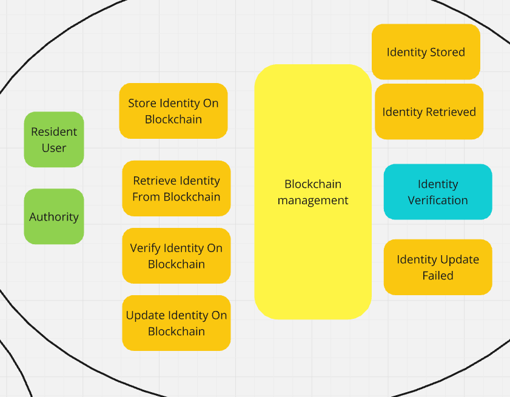
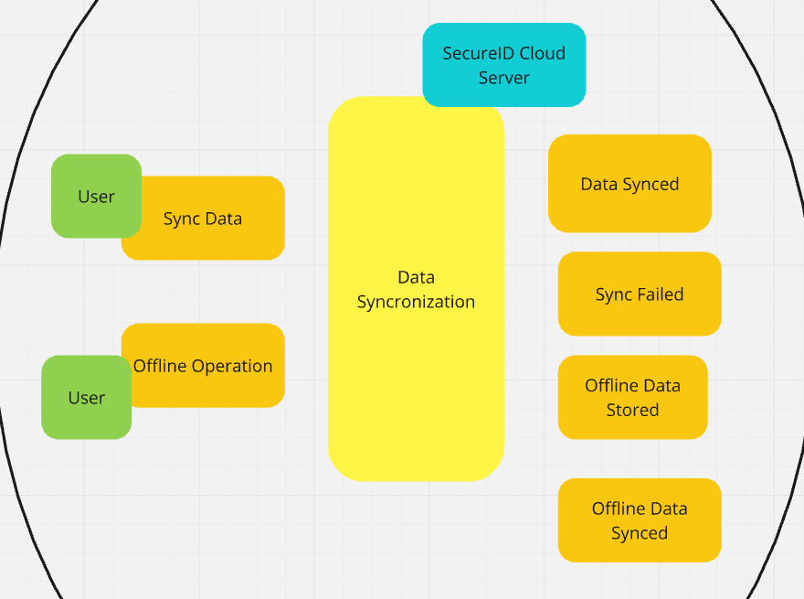
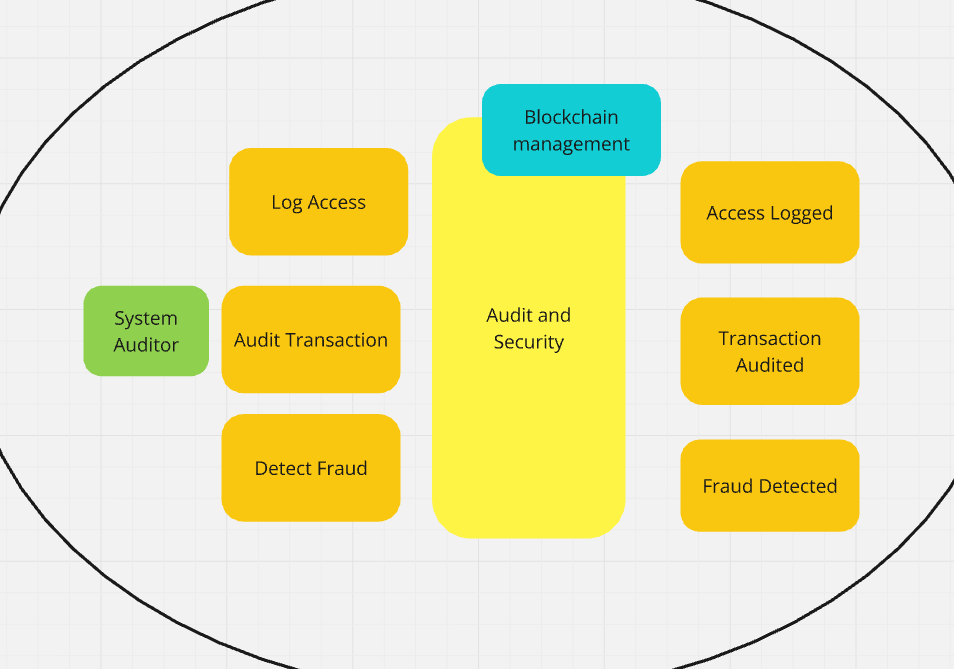
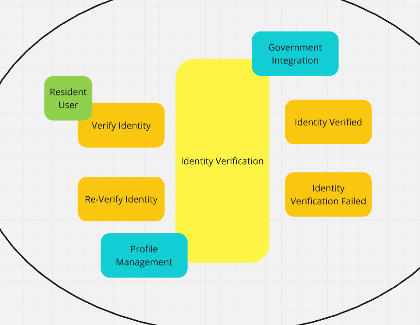
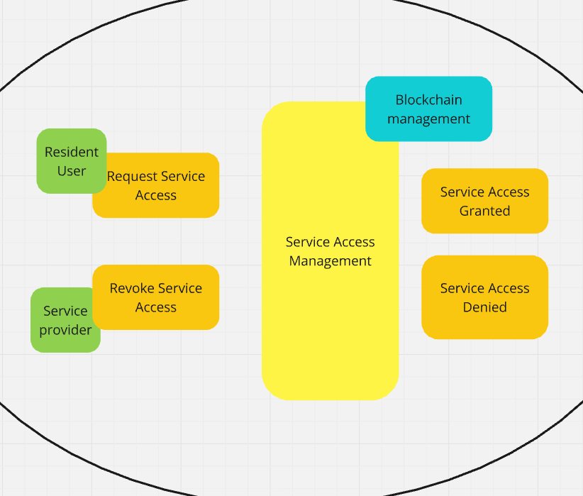

# Capítulo IV: Strategic-Level Software Design
---
## 4.1. Strategic-Level Attribute-Driven Design
### 4.1.1. Design Purpose
**Proposito:** El propósito de la solución SecureID es proporcionar una plataforma confiable y segura para el registro y verificación de identidades digitales en áreas rurales de Perú, utilizando tecnología blockchain. Al habilitar a los residentes de zonas remotas para que obtengan una identificación digital, la plataforma garantiza que puedan acceder a servicios esenciales como salud, educación y asistencia social. SecureID busca cerrar la brecha entre las comunidades rurales y los servicios gubernamentales, ofreciendo un sistema escalable, seguro y descentralizado.

**Problemática:** El problema principal que aborda SecureID es la falta de identificación formal entre los residentes de las regiones rurales de la sierra peruana. Muchas de estas áreas enfrentan desafíos logísticos para obtener una identificación tradicional, agravados por la limitada infraestructura, como la baja conectividad a internet, las barreras burocráticas y la resistencia cultural a los procesos formales. Esta falta de identificación impide que los residentes accedan a servicios públicos esenciales, lo que contribuye a la exclusión social y la desigualdad.

**Necesidades:**
- Registro confiable de identidad: Los residentes necesitan un medio seguro y accesible para registrar su identidad digital, incluso en áreas con conectividad limitada.
- Acceso a servicios esenciales: Es fundamental que puedan acceder a servicios como atención médica, educación y asistencia social, los cuales actualmente les son inaccesibles debido a la falta de identificación.
- Verificación segura y transparente: Las autoridades locales necesitan verificar la identidad de los residentes de manera eficiente y sin posibilidad de fraude, mediante un sistema seguro y transparente.
- Infraestructura adaptada a áreas rurales: La plataforma debe funcionar tanto en línea como fuera de línea para adaptarse a las limitaciones tecnológicas en estas zonas.

**Orientacion de diseño:**
- Simplicidad: Diseñar interfaces intuitivas y accesibles para usuarios con bajos niveles de alfabetización digital, priorizando la facilidad de uso.
- Seguridad: Utilizar blockchain privada para asegurar la inmutabilidad y privacidad de los datos personales, protegiéndolos contra fraudes y accesos no autorizados.
- Accesibilidad: Garantizar el funcionamiento de la plataforma tanto online como offline, permitiendo el registro y sincronización de datos en áreas con baja conectividad.
- Eficiencia: Facilitar la verificación rápida y precisa de identidades por parte de las autoridades locales, optimizando el acceso a los servicios esenciales.
Escalabilidad: Desarrollar un sistema adaptable que permita la expansión a otras regiones rurales y áreas con limitaciones tecnológicas.
- Integración: Asegurar la compatibilidad con los sistemas gubernamentales existentes para mejorar la gestión y distribución de recursos de manera eficiente.
---
### 4.1.2. Attribute-Driven Design Inputs
---
#### 4.1.2.1. Primary Functionality (Primary User Stories)
---
#### 4.1.2.2. Quality attribute Scenarios
---
#### 4.1.2.3. Constraints.
---
### 4.1.3. Architectural Drivers Backlog
---
### 4.1.4. Architectural Design Decisions
---
### 4.1.5. Quality Attribute Scenario Refinements
---
## 4.2. Strategic-Level Domain-Driven Design
---
### 4.2.1. EventStorming
Mediante la técnica del Event Storming definimos los siguientes Bounded Context los cuales son principales dentro del proyecto.

El diagrama completo se encuentra en el siguiente enlace: [SecureID_EventStorming](https://miro.com/app/board/uXjVKjwtUkA=/?share_link_id=781413633439).

**BlockChain Management**

**Data Synchronization Management**

**Audit and Security Management**

**Government Integration Management**

**Identity Verification Management**

**Profile Management**

**Service Access Management**

### 4.2.2. Candidate Context Discovery
---
### 4.2.3. Domain Message Flows Modeling
---
### 4.2.4. Bounded Context Canvases
---
### 4.2.5. Context Mapping
---
## 4.3. Software Architecture
---
### 4.3.1. Software Architecture System Landscape Diagram
---
### 4.3.2. Software Architecture Context Level Diagrams
---
### 4.3.3. Software Architecture Container Level Diagrams
---
### 4.3.4. Software Architecture Deployment Diagrams
---