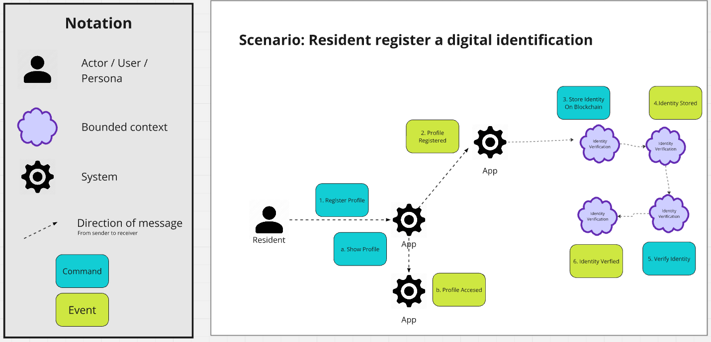
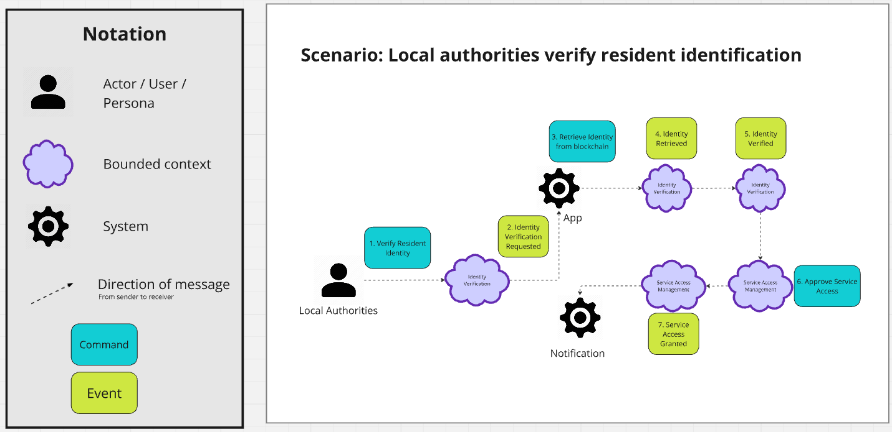

# Capítulo IV: Strategic-Level Software Design
---
## 4.1. Strategic-Level Attribute-Driven Design
---
### 4.1.1. Design Purpose
---
### 4.1.2. Attribute-Driven Design Inputs
---
#### 4.1.2.1. Primary Functionality (Primary User Stories)
---
#### 4.1.2.2. Quality attribute Scenarios
---
#### 4.1.2.3. Constraints.
---
### 4.1.3. Architectural Drivers Backlog
---
### 4.1.4. Architectural Design Decisions
---
### 4.1.5. Quality Attribute Scenario Refinements
---
## 4.2. Strategic-Level Domain-Driven Design
---
### 4.2.1. EventStorming
---
### 4.2.2. Candidate Context Discovery
---
### 4.2.3. Domain Message Flows Modeling
Este enfoque esencial nos permite visualizar y comprender cómo las diferentes partes de nuestro 
sistema interactúan entre sí mediante intercambios de mensajes. A través del modelado de flujos 
de mensajes, podemos capturar la lógica y la dinámica de nuestro dominio de manera clara y 
concisa, lo que facilita la comunicación y el diseño efectivo de sistemas complejos. 

**Scenario: Resident register a digital identification**

**Scenario: Local authorities verify resident identification**

Enlace a Miro: [SecureID_Message Flow](https://miro.com/app/board/uXjVM6QV_5Q=/?share_link_id=720006541665) 
### 4.2.4. Bounded Context Canvases
---
### 4.2.5. Context Mapping
---
## 4.3. Software Architecture
---
### 4.3.1. Software Architecture System Landscape Diagram
---
### 4.3.2. Software Architecture Context Level Diagrams
---
### 4.3.3. Software Architecture Container Level Diagrams
---
### 4.3.4. Software Architecture Deployment Diagrams
---