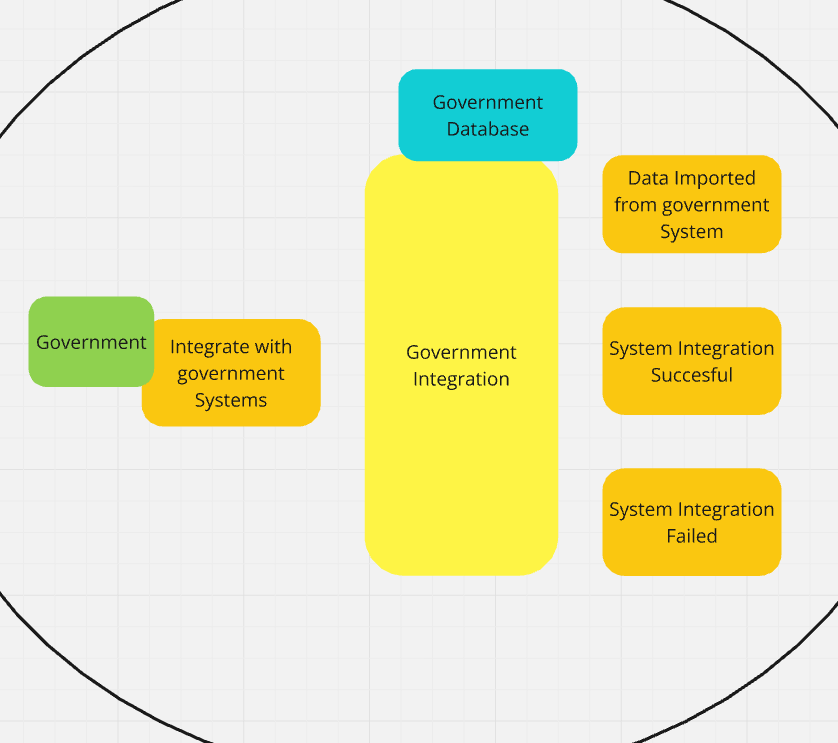
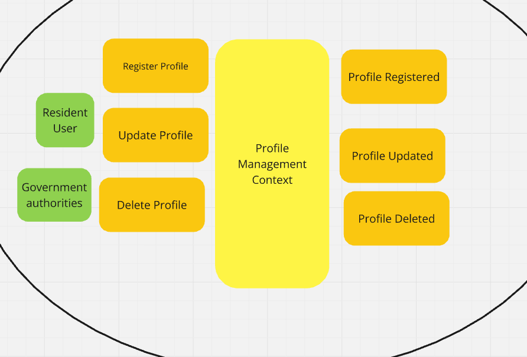
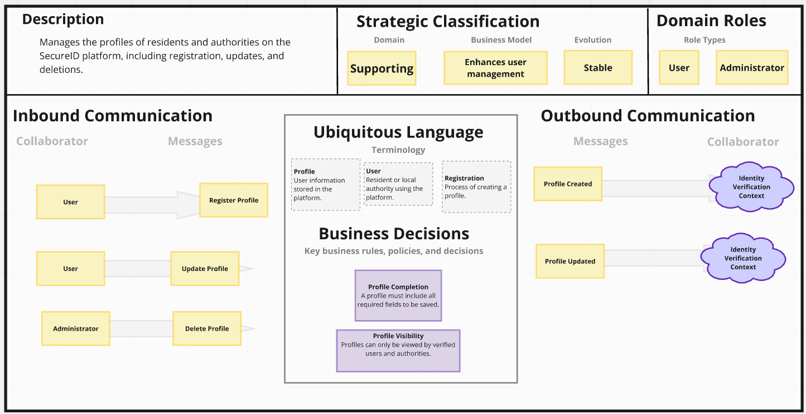
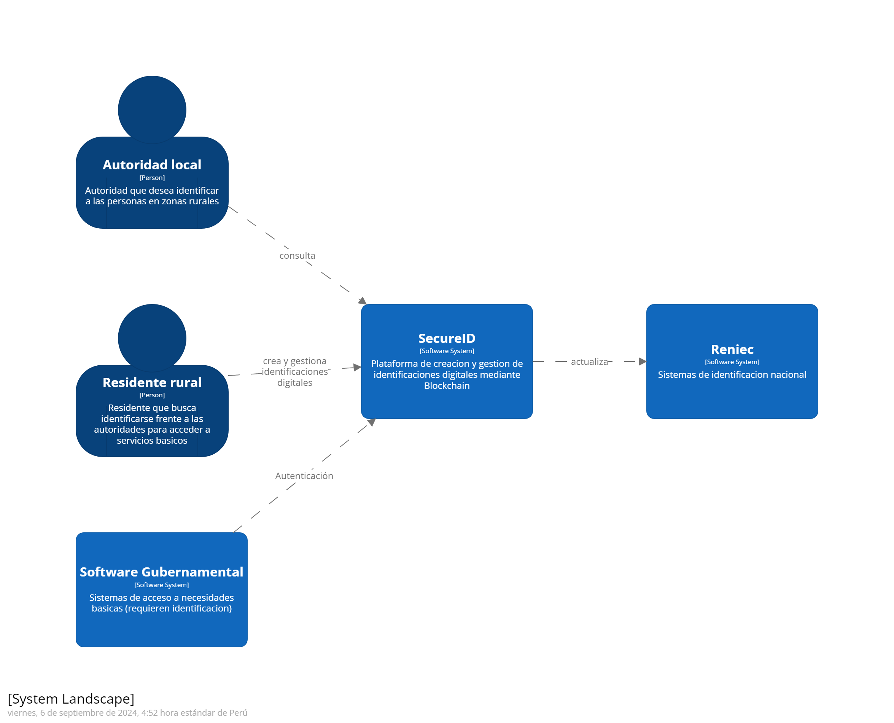
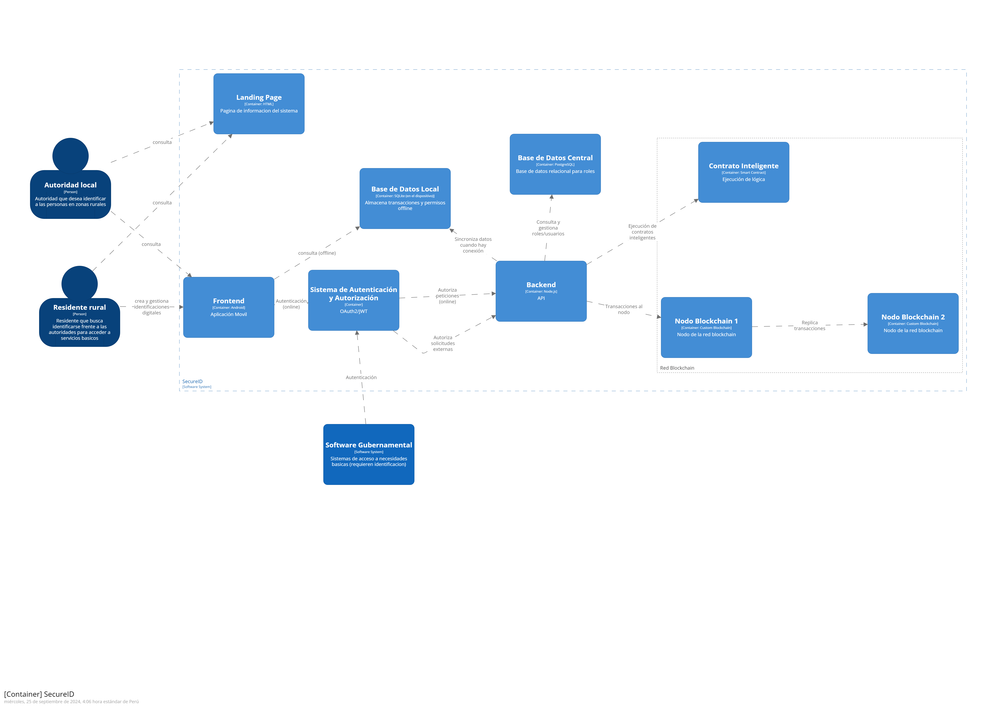

# Capítulo IV: Strategic-Level Software Design

## 4.1. Strategic-Level Attribute-Driven Design

### 4.1.1. Design Purpose
**Proposito:** El propósito de la solución SecureID es proporcionar una plataforma confiable y segura para el registro y verificación de identidades digitales en áreas rurales de Perú, utilizando tecnología blockchain. Al habilitar a los residentes de zonas remotas para que obtengan una identificación digital, la plataforma garantiza que puedan acceder a servicios esenciales como salud, educación y asistencia social. SecureID busca cerrar la brecha entre las comunidades rurales y los servicios gubernamentales, ofreciendo un sistema escalable, seguro y descentralizado.

**Problemática:** El problema principal que aborda SecureID es la falta de identificación formal entre los residentes de las regiones rurales de la sierra peruana. Muchas de estas áreas enfrentan desafíos logísticos para obtener una identificación tradicional, agravados por la limitada infraestructura, como la baja conectividad a internet, las barreras burocráticas y la resistencia cultural a los procesos formales. Esta falta de identificación impide que los residentes accedan a servicios públicos esenciales, lo que contribuye a la exclusión social y la desigualdad.

**Necesidades:**
- Registro confiable de identidad: Los residentes necesitan un medio seguro y accesible para registrar su identidad digital, incluso en áreas con conectividad limitada.
- Acceso a servicios esenciales: Es fundamental que puedan acceder a servicios como atención médica, educación y asistencia social, los cuales actualmente les son inaccesibles debido a la falta de identificación.
- Verificación segura y transparente: Las autoridades locales necesitan verificar la identidad de los residentes de manera eficiente y sin posibilidad de fraude, mediante un sistema seguro y transparente.
- Infraestructura adaptada a áreas rurales: La plataforma debe funcionar tanto en línea como fuera de línea para adaptarse a las limitaciones tecnológicas en estas zonas.

**Orientacion de diseño:**
- Simplicidad: Diseñar interfaces intuitivas y accesibles para usuarios con bajos niveles de alfabetización digital, priorizando la facilidad de uso.
- Seguridad: Utilizar blockchain privada para asegurar la inmutabilidad y privacidad de los datos personales, protegiéndolos contra fraudes y accesos no autorizados.
- Accesibilidad: Garantizar el funcionamiento de la plataforma tanto online como offline, permitiendo el registro y sincronización de datos en áreas con baja conectividad.
- Eficiencia: Facilitar la verificación rápida y precisa de identidades por parte de las autoridades locales, optimizando el acceso a los servicios esenciales.
Escalabilidad: Desarrollar un sistema adaptable que permita la expansión a otras regiones rurales y áreas con limitaciones tecnológicas.
- Integración: Asegurar la compatibilidad con los sistemas gubernamentales existentes para mejorar la gestión y distribución de recursos de manera eficiente.

---
### 4.1.2. Attribute-Driven Design Inputs

#### 4.1.2.1. Primary Functionality (Primary User Stories)
Esta sección describe los Epics e Historias de Usuario que tienen mayor impacto en la arquitectura de la solución SecureID. Estos requisitos funcionales son esenciales para el éxito del proyecto y deben ser considerados cuidadosamente durante el proceso de diseño.

| User Story ID | Título                                             | Descripción                                                                                                                                                                      | Criterios de aceptación                                                                                                  |
|---------------|----------------------------------------------------|----------------------------------------------------------------------------------------------------------------------------------------------------------------------------------|--------------------------------------------------------------------------------------------------------------------------|
| US09          | Implementación del Registro de Identidad en Blockchain | Como desarrollador backend, quiero implementar un servicio que registre las identidades de los usuarios en una blockchain privada para asegurar la inmutabilidad y seguridad de los datos. | • Dado que un usuario completa su registro, cuando los datos se envían al backend, entonces el sistema debe crear una entrada inmutable en la blockchain.    • Dado que el registro es exitoso, cuando se consulta la identidad, entonces los datos deben coincidir exactamente con los registrados. |
| US11          | Verificación de Identidad en Tiempo Real          | Como desarrollador backend, quiero implementar un servicio de verificación de identidad en tiempo real que permita a las autoridades locales verificar la identidad de un usuario contra la blockchain. | • Dado que una autoridad local consulta la identidad de un usuario, cuando se envían los datos al backend, entonces el sistema debe verificar la identidad en la blockchain y devolver una respuesta en tiempo real.    • Dado que la verificación es exitosa, cuando se recibe la respuesta, entonces debe indicar claramente la validez de la identidad. |
| US06          | Integración con Servicios Gubernamentales         | Como autoridad local, quiero que la plataforma SecureID esté integrada con los sistemas gubernamentales existentes para que pueda gestionar y verificar identidades de manera más eficiente. | • Dado que la plataforma está integrada, cuando realizo una consulta de identidad, entonces los datos se sincronizan y se verifican automáticamente con las bases de datos gubernamentales.    • Dado que la integración es exitosa, cuando gestiono recursos o asistencia, entonces puedo realizar estas tareas de manera más eficiente y con menos errores. |
| US05          | Uso de la Plataforma sin Conexión a Internet       | Como residente de la zona rural, quiero poder usar la plataforma SecureID incluso cuando no tengo acceso a internet, para que mi identificación digital esté disponible en todo momento. | • Dado que no tengo conexión a internet, cuando uso la plataforma, entonces mis datos se almacenan localmente y se sincronizan con la blockchain cuando la conexión se restablezca.    • Dado que la sincronización es exitosa, cuando reviso mi identificación digital, entonces los datos están actualizados y son consistentes. |
| US16          | Respaldo y Recuperación de Datos                   | Como desarrollador backend, quiero implementar un sistema robusto de respaldo y recuperación de datos para asegurar que la plataforma pueda recuperarse de fallos o pérdida de datos sin afectar la disponibilidad del servicio. | • Dado que ocurre una falla en el sistema, cuando se ejecuta el proceso de recuperación, entonces todos los datos deben ser restaurados a su estado más reciente sin pérdida significativa.    • Dado que el sistema de respaldo está en funcionamiento, cuando se revisan los registros de backup, entonces deben mostrar que las copias de seguridad se realizan de manera regular y sin errores. |

#### 4.1.2.2. Quality attribute Scenarios
Los escenarios de atributos de calidad identificados inicialmente se centran en aquellos que tienen un mayor impacto en la arquitectura de nuestra solución. Estos escenarios proporcionan una visión clara de cómo se espera que nuestro sistema responda a diferentes estímulos en términos de calidad. 

|Atributo   | Fuente  | Estímulo  | Entorno  | Respuesta  | Medida |
| ------------ | ------------ | ------------ | ------------ | ------------ | ------------ |
|  Usabilidad | Residente rural  |  El usuario intenta registrarse en la plataforma SecureID. |  Conectividad limitada o en un dispositivo móvil básico. | El sistema proporciona una interfaz clara, accesible y con asistencia paso a paso.  | Registro completado sin errores o abandonos (95% éxito).  |
|Disponibilidad   |  Residente rural | El usuario intenta acceder a su identificación digital sin conexión a internet.  | Sin conexión a internet (offline). | El sistema almacena los datos localmente y sincroniza cuando hay conexión disponible.  | Identificación accesible en modo offline el 100% del tiempo.  |
|Rendimiento   | Autoridad local  |  La autoridad local verifica la identidad de un residente. | Plataforma con alto volumen de solicitudes.  | Verificación completada en menos de 2 segundos.  |  Tiempo de verificación inferior a 2 segundos en el 95% de los casos. |
| Seguridad  | Gobierno / Autoridad local  | Un intento de acceso no autorizado a la plataforma es detectado.  | Plataforma en operación normal.  |  El sistema detecta el acceso no autorizado, lo bloquea y notifica a los administradores. |  Tiempo de detección y respuesta inferior a 1 segundo. |
|Escalabilidad   |  Administrador del sistema |Aumento repentino en el número de registros de identificación.   | Alto crecimiento de usuarios en poco tiempo.  | El sistema gestiona el crecimiento sin degradación en el rendimiento.  |El sistema soporta el 100% del incremento de usuarios sin caída.  |
|  Privacidad | Residente rural  | El residente envía datos personales para su registro en la plataforma.  | Durante el proceso de registro en la plataforma.  | Los datos son cifrados y almacenados de manera segura, cumpliendo con normativas de privacidad (GDPR, CCPA).  | Cifrado de datos sensibles en tránsito y en reposo; cumplimiento del 100% de las normativas de privacidad aplicables.  |

#### 4.1.2.3. Constraints.
Los constraints son características que no pueden ser negociadas y están impuestas por el cliente o el negocio como guía para la elaboración de la solución. A continuación, se presentan los principales constraints a considerar en el diseño de nuestra solución.

| Technical Story ID  | Título  |  Descripción |  Criterios de Aceptación | Relacionado con (Epic ID)  |
| ------------ | ------------ | ------------ | ------------ | ------------ |
|TS01   | Cumplimiento de Normativas de Privacidad  |  La plataforma debe cumplir con normativas internacionales de protección de datos, como el GDPR, para garantizar la privacidad y seguridad de los usuarios. | Todos los datos personales deben ser cifrados y protegidos; auditorías de cumplimiento de normativas deben realizarse periódicamente.  |  US04, US09 |
| TS02  |  Funcionamiento Offline | La plataforma debe permitir el registro y acceso a datos sin conexión a internet, sincronizando la información cuando se restablezca la conectividad.  |Los usuarios pueden registrar y consultar su identidad digital offline; los datos se sincronizan automáticamente una vez que la conexión a internet esté disponible.   | US05, US10  |
|TS03  |  Escalabilidad |El sistema debe ser escalable para manejar un crecimiento exponencial de usuarios sin afectar el rendimiento o la disponibilidad de los servicios.   |  El sistema debe soportar hasta 1 millón de usuarios simultáneos sin reducir su rendimiento; monitoreo de escalabilidad debe realizarse continuamente para ajustes en infraestructura. |  US08, US14 |
|  TS04 |  Integración con Sistemas Gubernamentales | SecureID debe integrarse con bases de datos y sistemas de servicios gubernamentales para validar la identidad de los usuarios y permitir el acceso a servicios.  |Las autoridades locales pueden acceder a los datos de los residentes a través de la integración con bases de datos gubernamentales; sincronización de datos correcta en tiempo real.   |  US06, US12 |
| TS05  |  Seguridad de Datos y Auditoría | La plataforma debe mantener un registro detallado de todas las transacciones e interacciones para auditorías de seguridad.  | Cada acción dentro de la plataforma debe generar un registro que puede ser auditado; el sistema debe detectar intentos de fraude y alertar a las autoridades locales en tiempo real.  | US04, US15  |
### 4.1.3. Architectural Drivers Backlog

Los drivers mapeados para nuestra plataforma SecureID, basado en las historias de usuario(US) señaladas anteriormente son:

| Driver ID     | Título de Driver  | Descripción | Importancia para Stakeholders (High, Medium, Low) | Impacto en Architecture Technical Complexity (High, Medium, Low) |
|-----------|----------|--------|---------|------------|
|ADB-01|Seguridad y Protección de Datos|Implementar medidas avanzadas de seguridad para proteger los datos personales y asegurar la inmutabilidad de la blockchain.|High|High|
|ADB-02|Escalabilidad del Sistema|Asegurar que la plataforma pueda manejar un gran número de usuarios y transacciones sin comprometer el rendimiento.|High|High|
|ADB-03|Sincronización de Datos Offline|Implementar un mecanismo que permita a los usuarios almacenar datos localmente cuando están offline y sincronizarlos con la blockchain cuando se restablezca la conexión.|High|Medium|
|ADB-04|Integración con Sistemas Gubernamentales|Facilitar la integración con bases de datos gubernamentales para la verificación de identidades y otros servicios, permitiendo una mayor eficiencia.|High|High|

### 4.1.4. Architectural Design Decisions

| Driver ID | Título de Driver  | Blockchain | Microservicios | Cliente-Servidor Tradicional |
|-----------|----------|--------|---------|------------|
|ADB-01|Seguridad y Protección de Datos|**PROS:** Alta seguridad, inmutabilidad, cifrado end-to-end. **CONTRA:** Complejidad en la implementación y en el cumplimiento regulatorio.|**PROS:** Modularidad, ya que cada servicio maneja su propia seguridad.**CONTRA:** Requiere una alta coordinación entre servicios para mantener seguridad global.|**PRO:** Sencillez en la implementación de medidas de seguridad. **CONTRA:** Menor robustez ante ataques o compromisos de un servidor.|
|ADB-02|Escalabilidad del Sistema|**PROS:** Escalabilidad casi infinita a medida que crece la red. **CONTRA:** Latencia en las transacciones por la validación distribuida.|**PROS:** Escalabilidad granular, cada servicio puede escalar por separado. **CONTRA:** Puede haber sobrecarga de comunicación y complejidad en la coordinacion.|**PROS:** Sencillo de gestionar en pequeñas escalas. **CONTRA:** Difícil escalar para manejar grandes volúmenes de usuarios o transacciones.|
|ADB-03|Sincronización de Datos Offline|**PROS:** Inmutabilidad y consistencia aseguradas cuando se sincronizan los datos. **CONTRA:** Complejidad en la implementación de mecanismos de sincronización offline.|**PROS:** Flexibilidad en la implementación de sincronización. **CONTRA:** Puede generar inconsistencias si los servicios no están bien coordinados.|**PROS:** Fácil de implementar la sincronización local.**CONTRA:**La lógica de sincronización es menos robusta y difícil de manejar en escenarios de desconexión prolongada.|
|ADB-04|Integración con Sistemas Gubernamentales|**PROS:** Provee trazabilidad y transparencia completa a las autoridades. **CONTRA:** Dificultades para que las instituciones adopten la tecnología blockchain.|**PROS:** Integración ágil con sistemas externos mediante APIs. **CONTRA:** La coordinacion de muchos servicios puede complicar la integración en tiempo real.|**PROS:** Fácil implementación inicial con sistemas externos.**CONTRA:**Menor flexibilidad y escalabilidad en la integración a gran escala.|

### 4.1.5. Quality Attribute Scenario Refinements
---
## 4.2. Strategic-Level Domain-Driven Design
---
### 4.2.1. EventStorming
Mediante la técnica del Event Storming definimos los siguientes Bounded Context los cuales son principales dentro del proyecto.

El diagrama completo se encuentra en el siguiente enlace: [SecureID_EventStorming](https://miro.com/app/board/uXjVKjwtUkA=/?share_link_id=781413633439).

**BlockChain Management**

**Data Synchronization Management**

**Audit and Security Management**

**Government Integration Management**

**Identity Verification Management**

**Profile Management**

**Service Access Management**

### 4.2.2. Candidate Context Discovery
La identificación de Candidate Context Discovery es un procedimiento orientado al descubrimiento de áreas potenciales para la delimitación dentro de un sistema complejo. Este proceso conlleva el análisis exhaustivo del sistema en cuestión, con el fin de identificar sus elementos fundamentales y las interacciones que entre ellos se establecen, para luego agruparlos en sectores lógicos de delimitación. Este enfoque se persigue con la finalidad de simplificar tanto el diseño como la ejecución del sistema. El objetivo principal radica en la mejora de la escalabilidad, el rendimiento y la capacidad de mantenimiento del sistema en cuestión.

**Candidate Context 1: Gestión de Perfiles**
- Se enfoca en la creación, actualización y eliminación de perfiles de usuario.
- Modularidad: Permite una gestión modular de los perfiles de usuario, facilitando el mantenimiento y escalabilidad.

**Candidate Context 2: Verificación de Identidad***
- Encargado de verificar y validar la identidad de los usuarios para garantizar que puedan acceder a servicios esenciales.
- Funcionalidad Específica: Enfocado en la validación de identidades, lo cual requiere una lógica de verificación específica y conexiones con sistemas externos.

### 4.2.3. Domain Message Flows Modeling
Este enfoque esencial nos permite visualizar y comprender cómo las diferentes partes de nuestro 
sistema interactúan entre sí mediante intercambios de mensajes. A través del modelado de flujos 
de mensajes, podemos capturar la lógica y la dinámica de nuestro dominio de manera clara y 
concisa, lo que facilita la comunicación y el diseño efectivo de sistemas complejos. 

**Scenario: Resident register a digital identification**

**Scenario: Local authorities verify resident identification**

Enlace a Miro: [SecureID_Message Flow](https://miro.com/app/board/uXjVM6QV_5Q=/?share_link_id=720006541665) 

### 4.2.4. Bounded Context Canvases
Estos lienzos son herramientas poderosas que nos permiten visualizar y definir los límites de 
nuestros contextos delimitados dentro de un dominio complejo. A través de la utilización de estos 
lienzos, podemos clarificar y comunicar de manera efectiva los límites y las interacciones entre los 
distintos subdominios de nuestro sistema. 

**Profile Management Context***

**Identity Verification Context***

**Service Access Management Context***

**Audit and Security Context***

**Government Integration Context***

**Blockchain Management Context***

Enlace a Miro: [SecureID_Context_Canvases](https://miro.com/app/board/uXjVM6QV_5Q=/?share_link_id=391390025740)

### 4.2.5. Context Mapping

Enlace a Miro: [SecureID_Context_Mapping](https://miro.com/app/board/uXjVKjwtUkA=/?share_link_id=864873335225)

## 4.3. Software Architecture
---
### 4.3.1. Software Architecture System Landscape Diagram
---

### 4.3.2. Software Architecture Context Level Diagrams
---

### 4.3.3. Software Architecture Container Level Diagrams
---

### 4.3.4. Software Architecture Deployment Diagrams
---

