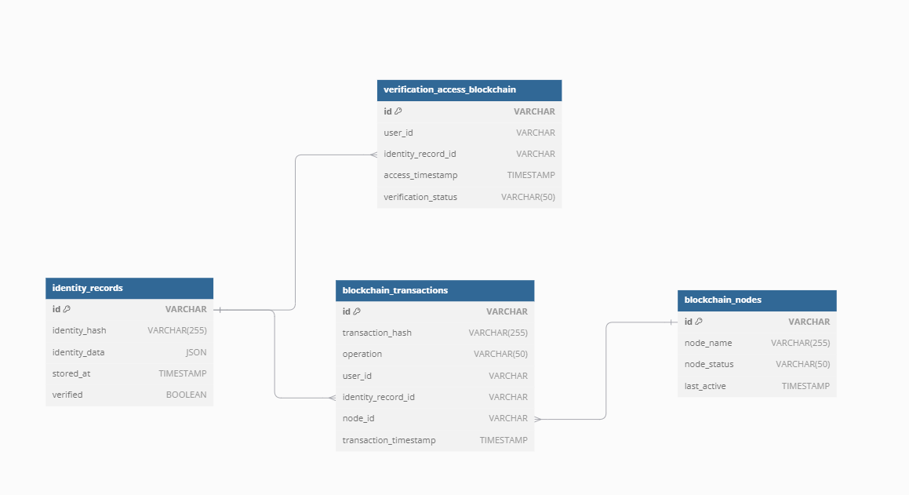

# Capítulo V: Tactical-Level Software Design

## 5.1. Bounded Context: Profile Management

### 5.1.1. Domain Layer
Aggregates

|Nombre|Categoría|Propósito|
| :- | :- | :- |
|Profile|root|Representa el perfil digital del usuario, central en la gestión de perfiles, incluye información personal.|
|ProfileHistory|Supporting Aggregate|Almacena el historial de cambios o actualizaciones realizadas en el perfil.|

Attributes

Profile

|Name|Data Type|Visibility|Description|
| :- | :- | :- | :- |
|profileID|UUID|Private|Identificador unico|
|name|String|Public|Nombre complete del usuario.|
|email|String|Public|Correo del usuario|
|phoneNumber|String|Public|Numero de contacto del usuario|
|address|String|Public|Direccion del usuario|
|dateOfBirth|Date|Public|Fecha de nacimiento|
|profileStatus|Enum (Active, Inactive, Deleted)|Private|Estado del usuario (active, inactive, eliminado)|

ProfileHistory

|Nombre|Tipo de Dato|Visibilidad|Descripción|
| :- | :- | :- | :- |
|changeID|UUID|private|ID único para cada registro de cambio.|
|changeType|Enum (Update, Delete, Create)|private|Tipo de cambio realizado en el perfil.|
|changeDate|DateTime|private|Fecha y hora en que se realizó el cambio.|
|changedBy|String|private|Usuario o entidad del sistema que realizó el cambio.|

Methods

Profile

|Nombre|Tipo de Retorno|Visibilidad|Descripción|
| :- | :- | :- | :- |
|registerProfile|void|public|Método para registrar un nuevo perfil de usuario con los campos requeridos (nombre, correo, etc.).|
|updateProfile|void|public|Actualiza los detalles del perfil existente, como el nombre o la dirección.|
|deleteProfile|void|public|Marca el perfil como eliminado, cambia el estado a "Eliminado".|
|activateProfile|void|public|Reactiva un perfil previamente inactivo.|
|getProfileStatus|Enum|public|Retorna el estado actual del perfil (Activo, Inactivo, Eliminado).|

ProfileHistory

|Nombre|Tipo de Retorno|Visibilidad|Descripción|
| :- | :- | :- | :- |
|logChange|void|private|Registra un cambio (crear, actualizar, eliminar) en el perfil con detalles relevantes.|
|getChangeHistory|List<ProfileHistory>|public|Recupera el historial de cambios realizados en un perfil específico.|

### 5.1.2. Interface Layer

Controllers

|Nombre|Categoría|Propósito|
| :- | :- | :- |
|ProfileController|RESTful API|Controlador principal para gestionar las operaciones del perfil de usuario (registro, actualización, eliminación).|
|ProfileHistoryController|RESTful API|Controlador para acceder al historial de cambios de los perfiles de usuario.|

Methods

ProfileController

|Name|Return Type|Visibility|Description|
| :- | :- | :- | :- |
|registerProfile|ProfileItem|Public|Crea un nuevo perfil en el sistema y devuelve el identificador único del perfil creado.|
|updateProfile|ProfileItem|Public|Actualiza los detalles del perfil según los datos proporcionados (nombre, correo, dirección, etc.).|
|deleteProfile|ProfileItem|Public|Marca el perfil como eliminado en el sistema y retorna un mensaje de confirmación.|
|activateProfile|ProfileItem|Public|Reactiva un perfil que estaba previamente inactivo.|
|getProfile|ProfileItem |Public|Recupera los detalles completos de un perfil específico por su ID.|

ProfileHistoryController

|Name|Return Type|Visibility|Description|
| :- | :- | :- | :- |
|getProfileHistory|ProfileItem|Public|Recupera el historial de cambios realizados en un perfil específico basado en su ID.|
|registerProfileHistoryChange|ProfileItem|Private|Registra un nuevo cambio en el historial de un perfil.|

### 5.1.3. Application Layer

Handlers

|Name|Category|Purpose|
| :- | :- | :- |
|ProfileCommandHandler|Command Handler|Gestiona los comandos relacionados con la creación, actualización y eliminación de perfiles.|
|ProfileQueryHandler|Query Handler|Se encarga de procesar consultas para recuperar datos de los perfiles, como el historial y los detalles de los perfiles.|

Atributes

**ProfileCommandHandler**

|Name|Data Type|Visibility|Description|
| :- | :- | :- | :- |
|profileRepository|ProfileRepository|Private|Repositorio para acceder y gestionar la información del perfil.|
|eventBus|EventBus|Private|Utilizado para publicar eventos cuando se realiza una acción en el perfil (p. ej., cuando se crea o elimina).|

**ProfileQueryHandler**

|Name|Data Type|Visibility|Description|
| :- | :- | :- | :- |
|profileRepository|ProfileRepository|Private|Repositorio que permite acceder a la información del perfil para las consultas.|
|profileHistoryRepository|ProfileHistoryRepository|Private|Repositorio que permite acceder al historial de cambios de los perfiles.|

### 5.1.4. Infrastructure Layer

Repository

|Name|Category|Purpose|
| :- | :- | :- |
|ProfileRepository|Data Repository|Maneja la persistencia y recuperación de los datos del perfil en la base de datos.|
|ProfileHistoryRepository|Data Repository|Se encarga de almacenar y recuperar el historial de modificaciones realizadas en los perfiles de los usuarios.|
|EventStoreRepository|Event Repository|Almacena y gestiona los eventos relacionados con las acciones de perfil, como la creación o eliminación.|

Atributes

ProfileRepository

|Name|Data Type|Visibility|Description|
| :- | :- | :- | :- |
|dbContext|DbContext|Private|Objeto que maneja las operaciones de base de datos y proporciona acceso a la información de los perfiles.|
|logger|ILogger|Private|Para registrar actividades o errores que ocurren durante las operaciones de la base de datos.|

ProfileHistoryRepository

|Name|Data Type|Visibility|Description|
| :- | :- | :- | :- |
|dbContext|DbContext|Private|Proporciona acceso a la base de datos para el historial de modificaciones de los perfiles.|
|logger|ILogger|Private|Registra eventos o errores que ocurren durante la gestión del historial de perfiles.|

### 5.1.6. Bounded Context Software Architecture Component Level Diagrams

### 5.1.7. Bounded Context Software Architecture Code Level Diagrams

#### 5.1.7.1. Bounded Context Domain Layer Class Diagrams

#### 5.1.7.2. Bounded Context Database Design Diagram

## 5.2. Bounded Context: Identity Verification

### 5.2.1. Domain Layer

Aggregate

|Name|Category|Purpose|
| :- | :- | :- |
|IdentityVerification|Aggregate|Gestionar el proceso de verificación de identidad.|

Attributes

|**Name**|**Data Type**|**Visibility**|**Description**|
| :- | :- | :- | :- |
|verification\_id|varchar|Public|Identificador único de la verificación de identidad.|
|profile\_id|varchar|Private|Identificador del usuario cuya identidad se verifica.|
|status|varchar|Public|Estado de la verificación (Pendiente, Aprobada, Rechazada).|
|verification\_date|timestamp|Private|Fecha en la que se realizó la verificación.|
|created\_at|timestamp|Private|Marca de tiempo de creación del registro.|
|updated\_at|timestamp|Private|Marca de tiempo de la última actualización.|

Methods

|**Name**|**Data Type**|**Visibility**|**Description**|
| :- | :- | :- | :- |
|initiateVerification|void|Public|Inicia el proceso de verificación de identidad.|
|checkVerificationStatus|varchar|Public|Verifica y retorna el estado actual de la verificación.|
|approveVerification|void|Public|Aprueba la verificación de identidad.|
|rejectVerification|void|Public|Rechaza la verificación de identidad.|
|logVerificationAttempt|void|Private|Registra un intento de verificación.|

### 5.2.2. Interface Layer

Controller

|**Name**|**Category**|**Purpose**|
| :- | :- | :- |
|IdentityVerificationController|Controller|Manejar las solicitudes relacionadas con la verificación de identidad.|

Methods

|**Name**|**Return Type**|**Visibility**|**Description**|
| :- | :- | :- | :- |
|initiateVerification|void|Public|Inicia el proceso de verificación de identidad para un usuario.|
|checkVerificationStatus|string|Public|Devuelve el estado actual de la verificación de identidad.|
|approveVerification|void|Public|Aprueba la verificación de identidad y actualiza el estado.|
|rejectVerification|void|Public|Rechaza la verificación de identidad y actualiza el estado.|
|logVerificationAttempt|void|Private|Registra un intento de verificación para auditoría.|

### 5.2.3. Application Layer

Handler

|**Name**|**Category**|**Purpose**|
| :- | :- | :- |
|IdentityVerificationHandler|Command Handler|Manejar la lógica de negocio para la verificación de identidad.|

Attributes

|**Name**|**Data Type**|**Visibility**|**Description**|
| :- | :- | :- | :- |
|profileId|integer|Public|ID del usuario cuya identidad se está verificando.|
|verificationStatus|string|Private|Estado actual de la verificación (Ej. Pendiente, Aprobado, Rechazado).|
|verificationRequestDate|timestamp|Private|Fecha y hora en que se realizó la solicitud de verificación.|
|verificationAttemptLogs|list|Private|Registros de intentos de verificación realizados.|
|externalVerificationService|string|Private|Servicio externo utilizado para la verificación de identidad.|

### 5.2.4. Infrastructure Layer

Repository

|**Name**|**Category**|**Purpose**|
| :- | :- | :- |
|IdentityVerificationRepository|Repository|Almacenar y gestionar datos relacionados con las verificaciones de identidad.|

Attributes

|**Name**|**Data Type**|**Visibility**|**Description**|
| :- | :- | :- | :- |
|id|integer|Public|ID único de la verificación de identidad.|
|profileId|integer|Public|ID del usuario cuya identidad ha sido verificada.|
|verificationStatus|string|Public|Estado de la verificación (Ej. Pendiente, Aprobado, Rechazado).|
|createdAt|timestamp|Private|Fecha y hora en que se creó el registro de verificación.|
|updatedAt|timestamp|Private|Fecha y hora de la última actualización del registro.|
|verificationAttemptLogs|list|Private|Registros de intentos de verificación realizados.|

### 5.2.6. Bounded Context Software Architecture Component Level Diagrams

### 5.2.7. Bounded Context Software Architecture Code Level Diagrams

#### 5.2.7.1. Bounded Context Domain Layer Class Diagrams

#### 5.2.7.2. Bounded Context Database Design Diagram

## 5.3. Bounded Context: Service Access Management

### 5.3.1. Domain Layer

Aggregate 

|**Name**|**Category**|**Purpose**|
| :- | :- | :- |
|ServiceAccess|Core Aggregate|Gestiona y controla el acceso a los servicios, vinculando a los perfiles con los permisos necesarios para acceder a servicios específicos.|

Attributes

|**Name**|**Data Type**|**Visibility**|**Description**|
| :- | :- | :- | :- |
|profileId|Integer|Private|Identificador único del perfil asociado a este acceso de servicio.|
|serviceId|Integer|Private|Identificador único del servicio al que se está gestionando el acceso.|
|accessLevel|String|Private|Nivel de acceso concedido al perfil (e.g., "read-only", "full access").|
|accessStatus|String|Private|Estado actual del acceso (e.g., "granted", "revoked", "pending").|
|grantedAt|Timestamp|Private|Fecha y hora en que se concedió el acceso al servicio.|
|revokedAt|Timestamp|Private|Fecha y hora en que se revocó el acceso, si es aplicable.|

Methods

|**Name**|**Data Type**|**Visibility**|**Description**|
| :- | :- | :- | :- |
|grantAccess|void|Public|Concede acceso al perfil para un servicio determinado, ajustando el accessLevel y el accessStatus.|
|revokeAccess|void|Public|Revoca el acceso del perfil al servicio especificado, actualizando el accessStatus a "revoked" y registrando la fecha en revokedAt.|
|updateAccessLevel|void|Public|Actualiza el nivel de acceso del perfil a un servicio específico (e.g., cambiar de "read-only" a "full access").|
|checkAccessStatus|String|Public|Devuelve el estado actual del acceso de un perfil a un servicio específico (e.g., "granted", "revoked").|
|logAccessAttempt|void|Private|Registra un intento de acceso al servicio, independientemente de si fue exitoso o no, con detalles adicionales para auditoría.|

### 5.3.2. Interface Layer

Controller

|**Name**|**Category**|**Purpose**|
| :- | :- | :- |
|ServiceAccessController|REST API|Controla las solicitudes relacionadas con la gestión del acceso a los servicios, sirviendo como interfaz entre los usuarios y el sistema.|

Methods

|**Name**|**Return Type**|**Visibility**|**Description**|
| :- | :- | :- | :- |
|grantAccess|HTTP Response|Public|Recibe una solicitud para conceder acceso a un servicio determinado para un perfil específico.|
|revokeAccess|HTTP Response|Public|Recibe una solicitud para revocar el acceso de un perfil a un servicio específico.|
|updateAccessLevel|HTTP Response|Public|Permite modificar el nivel de acceso de un perfil a un servicio determinado, ajustando permisos como sea necesario.|
|checkAccessStatus|JSON|Public|Devuelve el estado actual del acceso de un perfil a un servicio, indicando si el acceso está concedido o revocado.|
|logAccessAttempt|HTTP Response|Private|Registra y notifica los intentos de acceso al sistema, utilizado internamente para auditoría y monitoreo.|

### 5.3.3. Application Layer

Handler

|**Name**|**Category**|**Purpose**|
| :- | :- | :- |
|ServiceAccessHandler|Command Handler|Gestiona las operaciones relacionadas con la concesión, revocación y actualización del acceso a los servicios.|
|AccessAuditHandler|Event Handler|Se encarga de manejar los eventos relacionados con los intentos de acceso, registrándolos en el sistema para auditoría.|

Attributes

|**Name**|**Data Type**|**Visibility**|**Description**|
| :- | :- | :- | :- |
|serviceId|UUID|Private|Identificador único del servicio para el cual se está gestionando el acceso.|
|profileId|UUID|Private|Identificador único del perfil que solicita o tiene acceso a un servicio.|
|accessLevel|String|Private|Define el nivel de acceso otorgado (por ejemplo, "lectura", "escritura", "administrador").|
|requestTimestamp|Timestamp|Private|Almacena la fecha y hora de la solicitud de acceso o revocación, utilizado para fines de auditoría.|
|accessStatus|Boolean|Private|Indica si el acceso fue concedido (true) o revocado (false).|

### 5.3.4. Infrastructure Layer

Repository

|**Name**|**Category**|**Purpose**|
| :- | :- | :- |
|ServiceAccessRepository|Data Repository|Almacena y recupera la información relacionada con los accesos a servicios. Mantiene el estado del acceso concedido o revocado para los perfiles.|
|AccessAuditRepository|Event Repository|Almacena eventos relacionados con auditorías de accesos para su posterior análisis o seguimiento.|

Attributes

|**Name**|**Data Type**|**Visibility**|**Description**|
| :- | :- | :- | :- |
|serviceAccessId|UUID|Private|Identificador único del acceso al servicio, utilizado para la gestión y referencia de accesos.|
|profileId|UUID|Private|Identificador único del perfil que posee o solicita acceso al servicio.|
|accessLevel|String|Private|Indica el nivel de acceso otorgado (por ejemplo, "lectura", "escritura", "administrador").|
|accessTimestamp|Timestamp|Private|Fecha y hora de la acción de otorgar o revocar acceso, útil para auditoría y seguimiento.|
|auditEventId|UUID|Private|Identificador único para eventos de auditoría, usado para rastrear acciones relacionadas con el acceso a servicios.|

### 5.3.6. Bounded Context Software Architecture Component Level Diagrams

### 5.3.7. Bounded Context Software Architecture Code Level Diagrams

#### 5.3.7.1. Bounded Context Domain Layer Class Diagrams

#### 5.3.7.2. Bounded Context Database Design Diagram

## 5.4. Bounded Context: Audit and Security Context

### 5.4.1. Domain Layer

<table> <tr> <td colspan="2">Nombre:</td> <td colspan="2">FraudAlert</td> </tr> <tr> <td colspan="2">Categoría:</td> <td colspan="2">Entity</td> </tr> <tr> <td colspan="2">Propósito:</td> <td colspan="2">Gestionar las alertas de fraude detectadas por el sistema.</td> </tr> <tr> <td colspan="4" style="text-align: center; font-weight: bold;">Atributos</td> </tr> <tr> <td>Nombre</td> <td>Tipo de dato</td> <td>Visibilidad</td> <td>Descripción</td> </tr> <tr> <td>alertId</td> <td>UUID</td> <td>Privada</td> <td>Identificador único de la alerta de fraude.</td> </tr> <tr> <td>detectedAt</td> <td>Datetime</td> <td>Privada</td> <td>Fecha y hora en que se detectó el fraude.</td> </tr> <tr> <td>description</td> <td>String</td> <td>Privada</td> <td>Descripción del comportamiento sospechoso.</td> </tr> <tr> <td>severity</td> <td>String</td> <td>Privada</td> <td>Nivel de severidad de la alerta de fraude (baja, media, alta).</td> </tr> <tr> <td colspan="4" style="text-align: center; font-weight: bold;">Métodos</td> </tr> <tr> <td>raiseAlert</td> <td>void</td> <td>Pública</td> <td>Genera una nueva alerta de fraude con sus detalles.</td> </tr> <tr> <td>getAlertDetails</td> <td>String</td> <td>Pública</td> <td>Retorna los detalles de la alerta de fraude generada.</td> </tr> </table>

<table> <tr> <td colspan="2">Nombre:</td> <td colspan="2">Auditor</td> </tr> <tr> <td colspan="2">Categoría:</td> <td colspan="2">Domain Role</td> </tr> <tr> <td colspan="2">Propósito:</td> <td colspan="2">Entidad que representa a los auditores del sistema, quienes revisan los logs y manejan alertas de fraude.</td> </tr> <tr> <td colspan="4" style="text-align: center; font-weight: bold;">Atributos</td> </tr> <tr> <td>Nombre</td> <td>Tipo de dato</td> <td>Visibilidad</td> <td>Descripción</td> </tr> <tr> <td>auditorId</td> <td>UUID</td> <td>Privada</td> <td>Identificador único del auditor.</td> </tr> <tr> <td>name</td> <td>String</td> <td>Privada</td> <td>Nombre del auditor.</td> </tr> <tr> <td>assignedAlerts</td> <td>List&lt;FraudAlert&gt;</td> <td>Privada</td> <td>Lista de alertas de fraude asignadas al auditor.</td> </tr> <tr> <td>assignedLogs</td> <td>List&lt;AuditLog&gt;</td> <td>Privada</td> <td>Lista de logs de auditoría asignados al auditor para revisión.</td> </tr> <tr> <td colspan="4" style="text-align: center; font-weight: bold;">Métodos</td> </tr> <tr> <td>reviewLog</td> <td>void</td> <td>Pública</td> <td>Revisa un log de auditoría asignado.</td> </tr> <tr> <td>investigateAlert</td> <td>void</td> <td>Pública</td> <td>Investiga una alerta de fraude asignada.</td> </tr> </table>

<table> <tr> <td colspan="2">Nombre:</td> <td colspan="2">AuditRepository</td> </tr> <tr> <td colspan="2">Categoría:</td> <td colspan="2">Repository</td> </tr> <tr> <td colspan="2">Propósito:</td> <td colspan="2">Proporcionar métodos para acceder y almacenar logs de auditoría en la base de datos.</td> </tr> <tr> <td colspan="4" style="text-align: center; font-weight: bold;">Métodos</td> </tr> <tr> <td>saveLog</td> <td>void</td> <td>Pública</td> <td>Guarda un log de auditoría en el repositorio.</td> </tr> <tr> <td>getLogs</td> <td>List&lt;AuditLog&gt;</td> <td>Pública</td> <td>Obtiene todos los logs de auditoría almacenados.</td> </tr> </table>

### 5.4.2. Interface Layer

<table> <tr> <td colspan="2">Nombre:</td> <td colspan="2">AuditController</td> </tr> <tr> <td colspan="2">Categoría:</td> <td colspan="2">Controller</td> </tr> <tr> <td colspan="2">Propósito:</td> <td colspan="2">Manejar las solicitudes de los usuarios relacionadas con la auditoría de accesos y transacciones del sistema.</td> </tr> <tr> <td colspan="4" style="text-align: center; font-weight: bold;">Atributos</td> </tr> <tr> <td>Nombre</td> <td>Tipo de dato</td> <td>Visibilidad</td> <td>Descripción</td> </tr> <tr> <td>auditService</td> <td>AuditService</td> <td>Privada</td> <td>Servicio que realiza las operaciones de auditoría y se comunica con la capa de dominio.</td> </tr> <tr> <td colspan="4" style="text-align: center; font-weight: bold;">Métodos</td> </tr> <tr> <td>getAuditLogs</td> <td>List&lt;AuditLog&gt;</td> <td>Pública</td> <td>Devuelve todos los logs de auditoría a solicitud del usuario.</td> </tr> <tr> <td>getLogDetails</td> <td>AuditLog</td> <td>Pública</td> <td>Devuelve los detalles de un log de auditoría específico identificado por el ID.</td> </tr> </table>

<table> <tr> <td colspan="2">Nombre:</td> <td colspan="2">FraudAlertController</td> </tr> <tr> <td colspan="2">Categoría:</td> <td colspan="2">Controller</td> </tr> <tr> <td colspan="2">Propósito:</td> <td colspan="2">Manejar las solicitudes relacionadas con las alertas de fraude y notificar a los auditores o administradores.</td> </tr> <tr> <td colspan="4" style="text-align: center; font-weight: bold;">Atributos</td> </tr> <tr> <td>Nombre</td> <td>Tipo de dato</td> <td>Visibilidad</td> <td>Descripción</td> </tr> <tr> <td>fraudService</td> <td>FraudService</td> <td>Privada</td> <td>Servicio que gestiona las operaciones de detección y notificación de fraudes.</td> </tr> <tr> <td colspan="4" style="text-align: center; font-weight: bold;">Métodos</td> </tr> <tr> <td>raiseFraudAlert</td> <td>void</td> <td>Pública</td> <td>Genera una nueva alerta de fraude y notifica a los usuarios correspondientes.</td> </tr> <tr> <td>getFraudAlerts</td> <td>List&lt;FraudAlert&gt;</td> <td>Pública</td> <td>Devuelve una lista de todas las alertas de fraude activas.</td> </tr> </table>

<table> <tr> <td colspan="2">Nombre:</td> <td colspan="2">AuditConsumer</td> </tr> <tr> <td colspan="2">Categoría:</td> <td colspan="2">Consumer</td> </tr> <tr> <td colspan="2">Propósito:</td> <td colspan="2">Escuchar mensajes o eventos de auditoría enviados por otros servicios o componentes del sistema.</td> </tr> <tr> <td colspan="4" style="text-align: center; font-weight: bold;">Atributos</td> </tr> <tr> <td>Nombre</td> <td>Tipo de dato</td> <td>Visibilidad</td> <td>Descripción</td> </tr> <tr> <td>messageQueue</td> <td>Queue&lt;AuditMessage&gt;</td> <td>Privada</td> <td>Cola de mensajes desde donde se consumen los eventos de auditoría.</td> </tr> <tr> <td colspan="4" style="text-align: center; font-weight: bold;">Métodos</td> </tr> <tr> <td>consumeMessage</td> <td>void</td> <td>Pública</td> <td>Procesa un mensaje de auditoría recibido y lo envía al servicio de auditoría.</td> </tr> <tr> <td>processAuditMessage</td> <td>void</td> <td>Pública</td> <td>Procesa el contenido del mensaje de auditoría (por ejemplo, registrar el log).</td> </tr> </table>

### 5.4.3. Application Layer

<table> <tr> <td colspan="2">Nombre:</td> <td colspan="2">AuditCommandHandler</td> </tr> <tr> <td colspan="2">Categoría:</td> <td colspan="2">Command Handler</td> </tr> <tr> <td colspan="2">Propósito:</td> <td colspan="2">Gestionar los comandos relacionados con la creación y consulta de auditorías en el sistema.</td> </tr> <tr> <td colspan="4" style="text-align: center; font-weight: bold;">Atributos</td> </tr> <tr> <td>Nombre</td> <td>Tipo de dato</td> <td>Visibilidad</td> <td>Descripción</td> </tr> <tr> <td>auditService</td> <td>AuditService</td> <td>Privada</td> <td>Servicio que ejecuta las operaciones de auditoría definidas en el dominio.</td> </tr> <tr> <td>auditRepository</td> <td>AuditRepository</td> <td>Privada</td> <td>Repositorio que permite acceder y persistir datos de auditoría.</td> </tr> <tr> <td colspan="4" style="text-align: center; font-weight: bold;">Métodos</td> </tr> <tr> <td>handleCreateAuditCommand</td> <td>void</td> <td>Pública</td> <td>Gestiona la creación de un nuevo registro de auditoría a partir de un comando recibido.</td> </tr> <tr> <td>handleGetAuditLogCommand</td> <td>AuditLog</td> <td>Pública</td> <td>Gestiona la consulta de un log de auditoría en base a un comando de solicitud específico.</td> </tr> </table>

<table> <tr> <td colspan="2">Nombre:</td> <td colspan="2">FraudDetectionCommandHandler</td> </tr> <tr> <td colspan="2">Categoría:</td> <td colspan="2">Command Handler</td> </tr> <tr> <td colspan="2">Propósito:</td> <td colspan="2">Gestionar los comandos relacionados con la detección de fraude y la notificación a los auditores o administradores.</td> </tr> <tr> <td colspan="4" style="text-align: center; font-weight: bold;">Atributos</td> </tr> <tr> <td>Nombre</td> <td>Tipo de dato</td> <td>Visibilidad</td> <td>Descripción</td> </tr> <tr> <td>fraudService</td> <td>FraudService</td> <td>Privada</td> <td>Servicio que realiza las operaciones de detección de fraude.</td> </tr> <tr> <td>notificationService</td> <td>NotificationService</td> <td>Privada</td> <td>Servicio que maneja las notificaciones hacia los auditores y administradores en caso de fraude.</td> </tr> <tr> <td colspan="4" style="text-align: center; font-weight: bold;">Métodos</td> </tr> <tr> <td>handleFraudDetectionCommand</td> <td>void</td> <td>Pública</td> <td>Gestiona la detección de fraude y genera una notificación en base al comando recibido.</td> </tr> <tr> <td>handleNotifyAdminCommand</td> <td>void</td> <td>Pública</td> <td>Gestiona la notificación de un posible fraude a los administradores o auditores.</td> </tr> </table>

<table> <tr> <td colspan="2">Nombre:</td> <td colspan="2">AuditEventHandler</td> </tr> <tr> <td colspan="2">Categoría:</td> <td colspan="2">Event Handler</td> </tr> <tr> <td colspan="2">Propósito:</td> <td colspan="2">Manejar los eventos relacionados con la auditoría, como la creación y cierre de logs, y procesar los eventos para actualizaciones del sistema.</td> </tr> <tr> <td colspan="4" style="text-align: center; font-weight: bold;">Atributos</td> </tr> <tr> <td>Nombre</td> <td>Tipo de dato</td> <td>Visibilidad</td> <td>Descripción</td> </tr> <tr> <td>auditRepository</td> <td>AuditRepository</td> <td>Privada</td> <td>Repositorio utilizado para actualizar y acceder a los logs de auditoría.</td> </tr> <tr> <td>eventService</td> <td>EventService</td> <td>Privada</td> <td>Servicio que maneja los eventos dentro del sistema.</td> </tr> <tr> <td colspan="4" style="text-align: center; font-weight: bold;">Métodos</td> </tr> <tr> <td>onAuditLogCreated</td> <td>void</td> <td>Pública</td> <td>Procesa el evento de creación de un log de auditoría y actualiza el sistema de acuerdo a las políticas de negocio.</td> </tr> <tr> <td>onAuditLogClosed</td> <td>void</td> <td>Pública</td> <td>Maneja el cierre de un log de auditoría y realiza las actualizaciones necesarias en el sistema.</td> </tr> </table>

<table> <tr> <td colspan="2">Nombre:</td> <td colspan="2">FraudDetectionEventHandler</td> </tr> <tr> <td colspan="2">Categoría:</td> <td colspan="2">Event Handler</td> </tr> <tr> <td colspan="2">Propósito:</td> <td colspan="2">Manejar los eventos relacionados con la detección de fraudes y tomar las acciones correspondientes, como enviar alertas o bloquear accesos.</td> </tr> <tr> <td colspan="4" style="text-align: center; font-weight: bold;">Atributos</td> </tr> <tr> <td>Nombre</td> <td>Tipo de dato</td> <td>Visibilidad</td> <td>Descripción</td> </tr> <tr> <td>fraudRepository</td> <td>FraudRepository</td> <td>Privada</td> <td>Repositorio utilizado para acceder y actualizar los registros de fraudes detectados.</td> </tr> <tr> <td>eventService</td> <td>EventService</td> <td>Privada</td> <td>Servicio que maneja los eventos de fraude dentro del sistema.</td> </tr> <tr> <td colspan="4" style="text-align: center; font-weight: bold;">Métodos</td> </tr> <tr> <td>onFraudDetected</td> <td>void</td> <td>Pública</td> <td>Maneja el evento de detección de fraude y toma acciones como notificar a los administradores o bloquear las cuentas comprometidas.</td> </tr> <tr> <td>onFraudAlertResolved</td> <td>void</td> <td>Pública</td> <td>Procesa la resolución de una alerta de fraude y realiza las actualizaciones necesarias en el sistema.</td> </tr> </table>

### 5.4.4. Infrastructure Layer

<table> <tr> <td colspan="2">Nombre:</td> <td colspan="2">AuditRepositoryImpl</td> </tr> <tr> <td colspan="2">Categoría:</td> <td colspan="2">Repository Implementation</td> </tr> <tr> <td colspan="2">Propósito:</td> <td colspan="2">Implementar las interfaces de repositorio de auditoría para persistir y recuperar datos de auditoría desde la base de datos.</td> </tr> <tr> <td colspan="4" style="text-align: center; font-weight: bold;">Atributos</td> </tr> <tr> <td>Nombre</td> <td>Tipo de dato</td> <td>Visibilidad</td> <td>Descripción</td> </tr> <tr> <td>databaseConnection</td> <td>DatabaseConnection</td> <td>Privada</td> <td>Conexión a la base de datos que permite ejecutar operaciones de lectura y escritura en los registros de auditoría.</td> </tr> <tr> <td colspan="4" style="text-align: center; font-weight: bold;">Métodos</td> </tr> <tr> <td>saveAuditLog</td> <td>void</td> <td>Pública</td> <td>Guarda un nuevo log de auditoría en la base de datos.</td> </tr> <tr> <td>getAuditLogs</td> <td>List&lt;AuditLog&gt;</td> <td>Pública</td> <td>Recupera todos los logs de auditoría almacenados en la base de datos.</td> </tr> </table>

<table> <tr> <td colspan="2">Nombre:</td> <td colspan="2">FraudRepositoryImpl</td> </tr> <tr> <td colspan="2">Categoría:</td> <td colspan="2">Repository Implementation</td> </tr> <tr> <td colspan="2">Propósito:</td> <td colspan="2">Implementar el repositorio para almacenar y consultar datos relacionados con detecciones de fraude.</td> </tr> <tr> <td colspan="4" style="text-align: center; font-weight: bold;">Atributos</td> </tr> <tr> <td>Nombre</td> <td>Tipo de dato</td> <td>Visibilidad</td> <td>Descripción</td> </tr> <tr> <td>fraudDatabaseConnection</td> <td>DatabaseConnection</td> <td>Privada</td> <td>Conexión a la base de datos especializada en la detección de fraudes.</td> </tr> <tr> <td colspan="4" style="text-align: center; font-weight: bold;">Métodos</td> </tr> <tr> <td>saveFraudAlert</td> <td>void</td> <td>Pública</td> <td>Almacena una nueva alerta de fraude en la base de datos.</td> </tr> <tr> <td>getFraudAlerts</td> <td>List&lt;FraudAlert&gt;</td> <td>Pública</td> <td>Recupera las alertas de fraude almacenadas en la base de datos.</td> </tr> </table>

<table> <tr> <td colspan="2">Nombre:</td> <td colspan="2">MessageBrokerImpl</td> </tr> <tr> <td colspan="2">Categoría:</td> <td colspan="2">Message Broker</td> </tr> <tr> <td colspan="2">Propósito:</td> <td colspan="2">Implementar el sistema de mensajería que envía notificaciones de alertas de fraude y auditoría a otros servicios.</td> </tr> <tr> <td colspan="4" style="text-align: center; font-weight: bold;">Atributos</td> </tr> <tr> <td>Nombre</td> <td>Tipo de dato</td> <td>Visibilidad</td> <td>Descripción</td> </tr> <tr> <td>messageQueue</td> <td>MessageQueue</td> <td>Privada</td> <td>Cola de mensajes utilizada para enviar notificaciones a otros sistemas.</td> </tr> <tr> <td colspan="4" style="text-align: center; font-weight: bold;">Métodos</td> </tr> <tr> <td>sendFraudAlert</td> <td>void</td> <td>Pública</td> <td>Envía una alerta de fraude a través del sistema de mensajería.</td> </tr> <tr> <td>sendAuditLogNotification</td> <td>void</td> <td>Pública</td> <td>Envía una notificación cuando se registra un nuevo log de auditoría.</td> </tr> </table>

<table> <tr> <td colspan="2">Nombre:</td> <td colspan="2">EmailServiceImpl</td> </tr> <tr> <td colspan="2">Categoría:</td> <td colspan="2">Email Service</td> </tr> <tr> <td colspan="2">Propósito:</td> <td colspan="2">Implementar el servicio de correo electrónico para notificar a los auditores o administradores de las alertas de seguridad.</td> </tr> <tr> <td colspan="4" style="text-align: center; font-weight: bold;">Atributos</td> </tr> <tr> <td>Nombre</td> <td>Tipo de dato</td> <td>Visibilidad</td> <td>Descripción</td> </tr> <tr> <td>emailServer</td> <td>EmailServer</td> <td>Privada</td> <td>Servidor de correo configurado para enviar notificaciones de seguridad.</td> </tr> <tr> <td colspan="4" style="text-align: center; font-weight: bold;">Métodos</td> </tr> <tr> <td>sendFraudAlertEmail</td> <td>void</td> <td>Pública</td> <td>Envía un correo electrónico notificando una alerta de fraude.</td> </tr> <tr> <td>sendAuditLogEmail</td> <td>void</td> <td>Pública</td> <td>Envía un correo notificando la creación o cierre de un log de auditoría.</td> </tr> </table>

### 5.4.6. Bounded Context Software Architecture Component Level Diagrams

### 5.4.7. Bounded Context Software Architecture Code Level Diagrams

#### 5.4.7.1. Bounded Context Domain Layer Class Diagrams

#### 5.4.7.2. Bounded Context Database Design Diagram

## 5.5. Bounded Context: Government Integration Context

### 5.5.1. Domain Layer

<table> <tr> <td colspan="2">Nombre:</td> <td colspan="2">GovernmentDatabase</td> </tr> <tr> <td colspan="2">Categoría:</td> <td colspan="2">Entity</td> </tr> <tr> <td colspan="2">Propósito:</td> <td colspan="2">Representa la base de datos gubernamental que contiene la información de los ciudadanos.</td> </tr> <tr> <td colspan="4" style="text-align: center; font-weight: bold;">Atributos</td> </tr> <tr> <td>Nombre</td> <td>Tipo de dato</td> <td>Visibilidad</td> <td>Descripción</td> </tr> <tr> <td>id</td> <td>UUID</td> <td>private</td> <td>Identificador único del registro de la base de datos del gobierno.</td> </tr> <tr> <td>citizenInfo</td> <td>String</td> <td>private</td> <td>Información relevante del ciudadano, como nombre, dirección y otros datos de identificación.</td> </tr> <tr> <td>eligibilityStatus</td> <td>boolean</td> <td>private</td> <td>Indica si un usuario cumple con los requisitos de elegibilidad.</td> </tr> <tr> <td colspan="4" style="text-align: center; font-weight: bold;">Métodos</td> </tr> <tr> <td>syncWithGovernmentSystem</td> <td>void</td> <td>public</td> <td>Sincroniza los datos de identidad del usuario con los sistemas gubernamentales.</td> </tr> <tr> <td>checkEligibility</td> <td>boolean</td> <td>public</td> <td>Verifica si el usuario es elegible para recibir ciertos servicios en función de las bases de datos gubernamentales.</td> </tr> </table>

<table> <tr> <td colspan="2">Nombre:</td> <td colspan="2">IntegrationService</td> </tr> <tr> <td colspan="2">Categoría:</td> <td colspan="2">Domain Service</td> </tr> <tr> <td colspan="2">Propósito:</td> <td colspan="2">Gestiona la conexión y sincronización entre SecureID y los sistemas externos del gobierno.</td> </tr> <tr> </tr> <tr> <td colspan="4" style="text-align: center; font-weight: bold;">Métodos</td> </tr> <tr> <td>requestVerification</td> <td>VerificationRequest</td> <td>public</td> <td>Genera una solicitud de verificación de identidad para el sistema del gobierno.</td> </tr> </table>

<table> <tr> <td colspan="2">Nombre:</td> <td colspan="2">EligibilityCheck</td> </tr> <tr> <td colspan="2">Categoría:</td> <td colspan="2">Value Object</td> </tr> <tr> <td colspan="2">Propósito:</td> <td colspan="2">Encapsula las reglas de verificación de elegibilidad de los usuarios.</td> </tr> <tr> <td colspan="4" style="text-align: center; font-weight: bold;">Atributos</td> </tr> <tr> <td>eligibilityCriteria</td> <td>String</td> <td>private</td> <td>Criterios que determinan la elegibilidad.</td> </tr> <tr> <td>isEligible</td> <td>boolean</td> <td>private</td> <td>Resultado de la verificación de elegibilidad.</td> </tr> <tr> <td colspan="4" style="text-align: center; font-weight: bold;">Métodos</td> </tr> <tr> <td>checkEligibility</td> <td>boolean</td> <td>public</td> <td>Verifica si el usuario cumple con los criterios de elegibilidad.</td> </tr> </table>

### 5.5.2. Interface Layer

<table> <tr> <td colspan="2">Nombre:</td> <td colspan="2">GovernmentIntegrationController</td> </tr> <tr> <td colspan="2">Categoría:</td> <td colspan="2">Controller</td> </tr> <tr> <td colspan="2">Propósito:</td> <td colspan="2">Expone las API necesarias para interactuar con el gobierno, gestionando solicitudes de verificación.</td> </tr> <tr> <td colspan="4" style="text-align: center; font-weight: bold;">Atributos</td> </tr> <tr> <td>integrationService</td> <td>IntegrationService</td> <td>private</td> <td>Servicio que maneja la lógica de integración con los sistemas del gobierno.</td> </tr> <tr> <td colspan="4" style="text-align: center; font-weight: bold;">Métodos</td> </tr> <tr> <td>submitVerificationRequest</td> <td>ResponseEntity</td> <td>public</td> <td>Envía una solicitud de verificación al sistema del gobierno para un usuario específico.</td> </tr> <tr> <td>handleGovernmentResponse</td> <td>void</td> <td>public</td> <td>Procesa las respuestas recibidas de los sistemas gubernamentales tras una solicitud de verificación.</td> </tr> </table>

<table> <tr> <td colspan="2">Nombre:</td> <td colspan="2">VerificationRequestConsumer</td> </tr> <tr> <td colspan="2">Categoría:</td> <td colspan="2">Consumer</td> </tr> <tr> <td colspan="2">Propósito:</td> <td colspan="2">Consume solicitudes de verificación de identidad provenientes del contexto de verificación de identidad.</td> </tr> <tr> <td colspan="4" style="text-align: center; font-weight: bold;">Atributos</td> </tr> <tr> <td colspan="4">Ninguno</td> </tr> <tr> <td colspan="4" style="text-align: center; font-weight: bold;">Métodos</td> </tr> <tr> <td>processVerificationRequest</td> <td>void</td> <td>public</td> <td>Procesa una solicitud de verificación de identidad enviada desde otro contexto.</td> </tr> </table>

### 5.5.3. Application Layer

<table> <tr> <td colspan="2">Nombre:</td> <td colspan="2">VerificationCommandHandler</td> </tr> <tr> <td colspan="2">Categoría:</td> <td colspan="2">Command Handler</td> </tr> <tr> <td colspan="2">Propósito:</td> <td colspan="2">Maneja los comandos relacionados con la verificación de identidad y la integración con el gobierno.</td> </tr> <tr> <td colspan="4" style="text-align: center; font-weight: bold;">Atributos</td> </tr> <tr> <td>integrationService</td> <td>IntegrationService</td> <td>private</td> <td>Servicio que maneja la lógica de integración en respuesta a comandos.</td> </tr> <tr> <td colspan="4" style="text-align: center; font-weight: bold;">Métodos</td> </tr> <tr> <td>handleVerificationCommand</td> <td>void</td> <td>public</td> <td>Maneja la ejecución de un comando para enviar una solicitud de verificación al gobierno.</td> </tr> </table>

<table> <tr> <td colspan="2">Nombre:</td> <td colspan="2">GovernmentEventHandler</td> </tr> <tr> <td colspan="2">Categoría:</td> <td colspan="2">Event Handler</td> </tr> <tr> <td colspan="2">Propósito:</td> <td colspan="2">Procesa eventos emitidos desde los sistemas del gobierno, como las respuestas a solicitudes de verificación.</td> </tr> <tr> <td colspan="4" style="text-align: center; font-weight: bold;">Atributos</td> </tr> <tr> <td>integrationService</td> <td>IntegrationService</td> <td>private</td> <td>Servicio que se utiliza para procesar eventos emitidos por el gobierno.</td> </tr> <tr> <td colspan="4" style="text-align: center; font-weight: bold;">Métodos</td> </tr> <tr> <td>processGovernmentEvent</td> <td>void</td> <td>public</td> <td>Procesa los eventos generados por el gobierno, como la recepción de datos de verificación.</td> </tr> </table>

### 5.5.4. Infrastructure Layer

<table> <tr> <td colspan="2">Nombre:</td> <td colspan="2">GovernmentSystemRepository</td> </tr> <tr> <td colspan="2">Categoría:</td> <td colspan="2">Repository</td> </tr> <tr> <td colspan="2">Propósito:</td> <td colspan="2">Interactúa con la base de datos del gobierno para consultar y almacenar datos relacionados con los usuarios.</td> </tr> <tr> <td colspan="4" style="text-align: center; font-weight: bold;">Atributos</td> </tr> <tr> <td>dataSource</td> <td>DataSource</td> <td>private</td> <td>Fuente de datos que proporciona acceso a la base de datos del gobierno.</td> </tr> <tr> <td colspan="4" style="text-align: center; font-weight: bold;">Métodos</td> </tr> <tr> <td>saveVerificationRequest</td> <td>void</td> <td>public</td> <td>Guarda una solicitud de verificación en la base de datos del gobierno.</td> </tr> </table>

<table> <tr> <td colspan="2">Nombre:</td> <td colspan="2">GovernmentMessageBroker</td> </tr> <tr> <td colspan="2">Categoría:</td> <td colspan="2">Message Broker</td> </tr> <tr> <td colspan="2">Propósito:</td> <td colspan="2">Gestiona la comunicación entre el sistema SecureID y los sistemas del gobierno a través de mensajería.</td> </tr> <tr> <td colspan="4" style="text-align: center; font-weight: bold;">Atributos</td> </tr> <tr> <td>messageQueue</td> <td>Queue</td> <td>private</td> <td>Cola de mensajes utilizada para intercambiar información con el sistema gubernamental.</td> </tr> <tr> <td colspan="4" style="text-align: center; font-weight: bold;">Métodos</td> </tr> <tr> <td>sendMessageToGovernment</td> <td>void</td> <td>public</td> <td>Envía un mensaje de solicitud de verificación al sistema gubernamental.</td> </tr> </table>

### 5.5.6. Bounded Context Software Architecture Component Level Diagrams

### 5.5.7. Bounded Context Software Architecture Code Level Diagrams

#### 5.5.7.1. Bounded Context Domain Layer Class Diagrams

#### 5.5.7.2. Bounded Context Database Design Diagram

## 5.6. Bounded Context: Blockchain Management Context

### 5.6.1. Domain Layer

<table> <tr> <td colspan="2">Nombre:</td> <td colspan="2">Blockchain</td> </tr> <tr> <td colspan="2">Categoría:</td> <td colspan="2">Entity</td> </tr> <tr> <td colspan="2">Propósito:</td> <td colspan="2">Representa la cadena de bloques que almacena información de identidad de forma segura e inmutable.</td> </tr> <tr> <td colspan="4" style="text-align: center; font-weight: bold;">Atributos</td> </tr> <tr> <td>blockId</td> <td>UUID</td> <td>private</td> <td>Identificador único del bloque dentro de la cadena de bloques.</td> </tr> <tr> <td>identityData</td> <td>String</td> <td>private</td> <td>Información de identidad almacenada en el bloque de la blockchain.</td> </tr> <tr> <td>previousHash</td> <td>String</td> <td>private</td> <td>El hash del bloque anterior en la cadena, lo que garantiza la inmutabilidad.</td> </tr> <tr> <td>timestamp</td> <td>LocalDateTime</td> <td>private</td> <td>Fecha y hora en que se almacenó el bloque en la cadena.</td> </tr> <tr> <td colspan="4" style="text-align: center; font-weight: bold;">Métodos</td> </tr> <tr> <td>generateHash</td> <td>String</td> <td>public</td> <td>Genera el hash del bloque actual basado en sus datos y el bloque anterior.</td> </tr> <tr> <td>verifyIntegrity</td> <td>boolean</td> <td>public</td> <td>Verifica la integridad del bloque y si no ha sido alterado.</td> </tr> </table>

<table> <tr> <td colspan="2">Nombre:</td> <td colspan="2">BlockchainNode</td> </tr> <tr> <td colspan="2">Categoría:</td> <td colspan="2">Entity</td> </tr> <tr> <td colspan="2">Propósito:</td> <td colspan="2">Representa un nodo de la red blockchain que gestiona y almacena bloques de identidad.</td> </tr> <tr> <td colspan="4" style="text-align: center; font-weight: bold;">Atributos</td> </tr> <tr> <td>nodeId</td> <td>UUID</td> <td>private</td> <td>Identificador único del nodo en la red blockchain.</td> </tr> <tr> <td>blockchain</td> <td>List&lt;Blockchain&gt;</td> <td>private</td> <td>Lista de bloques de la cadena que maneja el nodo.</td> </tr> <tr> <td colspan="4" style="text-align: center; font-weight: bold;">Métodos</td> </tr> <tr> <td>addBlock</td> <td>void</td> <td>public</td> <td>Agrega un nuevo bloque a la cadena de bloques del nodo.</td> </tr> <tr> <td>getBlockById</td> <td>Blockchain</td> <td>public</td> <td>Recupera un bloque específico de la cadena por su identificador.</td> </tr> </table>

<table> <tr> <td colspan="2">Nombre:</td> <td colspan="2">IdentityVerification</td> </tr> <tr> <td colspan="2">Categoría:</td> <td colspan="2">Value Object</td> </tr> <tr> <td colspan="2">Propósito:</td> <td colspan="2">Encapsula la verificación de identidades almacenadas en la blockchain.</td> </tr> <tr> <td colspan="4" style="text-align: center; font-weight: bold;">Atributos</td> </tr> <tr> <td>verificationId</td> <td>UUID</td> <td>private</td> <td>Identificador único de la verificación de identidad.</td> </tr> <tr> <td>identityHash</td> <td>String</td> <td>private</td> <td>Hash de la identidad verificada en la blockchain.</td> </tr> <tr> <td>isVerified</td> <td>boolean</td> <td>private</td> <td>Indica si la identidad ha sido verificada correctamente.</td> </tr> <tr> <td colspan="4" style="text-align: center; font-weight: bold;">Métodos</td> </tr> <tr> <td>verifyIdentity</td> <td>boolean</td> <td>public</td> <td>Realiza la verificación de una identidad utilizando los datos almacenados en la blockchain.</td> </tr> </table>

### 5.6.2. Interface Layer

<table> <tr> <td colspan="2">Nombre:</td> <td colspan="2">BlockchainController</td> </tr> <tr> <td colspan="2">Categoría:</td> <td colspan="2">Controller</td> </tr> <tr> <td colspan="2">Propósito:</td> <td colspan="2">Proporciona las API para almacenar y recuperar identidades de la blockchain.</td> </tr> <tr> <td colspan="4" style="text-align: center; font-weight: bold;">Atributos</td> </tr> <tr> <td>blockchainService</td> <td>BlockchainService</td> <td>private</td> <td>Servicio que maneja la lógica relacionada con la blockchain.</td> </tr> <tr> <td colspan="4" style="text-align: center; font-weight: bold;">Métodos</td> </tr> <tr> <td>storeIdentity</td> <td>ResponseEntity</td> <td>public</td> <td>Almacena la identidad en la blockchain a través de una solicitud HTTP.</td> </tr> <tr> <td>retrieveIdentity</td> <td>ResponseEntity</td> <td>public</td> <td>Recupera la identidad de la blockchain utilizando el identificador de la solicitud.</td> </tr> </table>

### 5.6.3. Application Layer

<table> <tr> <td colspan="2">Nombre:</td> <td colspan="2">StoreIdentityCommandHandler</td> </tr> <tr> <td colspan="2">Categoría:</td> <td colspan="2">Command Handler</td> </tr> <tr> <td colspan="2">Propósito:</td> <td colspan="2">Maneja los comandos relacionados con el almacenamiento de identidades en la blockchain.</td> </tr> <tr> <td colspan="4" style="text-align: center; font-weight: bold;">Atributos</td> </tr> <tr> <td>blockchainService</td> <td>BlockchainService</td> <td>private</td> <td>Servicio encargado de ejecutar los comandos para interactuar con la blockchain.</td> </tr> <tr> <td colspan="4" style="text-align: center; font-weight: bold;">Métodos</td> </tr> <tr> <td>handleStoreIdentityCommand</td> <td>void</td> <td>public</td> <td>Maneja el comando para almacenar una nueva identidad en la blockchain.</td> </tr> </table>

<table> <tr> <td colspan="2">Nombre:</td> <td colspan="2">RetrieveIdentityEventHandler</td> </tr> <tr> <td colspan="2">Categoría:</td> <td colspan="2">Event Handler</td> </tr> <tr> <td colspan="2">Propósito:</td> <td colspan="2">Maneja los eventos relacionados con la recuperación de identidades de la blockchain.</td> </tr> <tr> <td colspan="4" style="text-align: center; font-weight: bold;">Atributos</td> </tr> <tr> <td>blockchainService</td> <td>BlockchainService</td> <td>private</td> <td>Servicio que ejecuta la lógica para recuperar una identidad cuando ocurre un evento.</td> </tr> <tr> <td colspan="4" style="text-align: center; font-weight: bold;">Métodos</td> </tr> <tr> <td>handleRetrieveIdentityEvent</td> <td>void</td> <td>public</td> <td>Maneja el evento para recuperar la identidad solicitada desde la blockchain.</td> </tr> </table>

### 5.6.4. Infrastructure Layer

<table> <tr> <td colspan="2">Nombre:</td> <td colspan="2">BlockchainRepository</td> </tr> <tr> <td colspan="2">Categoría:</td> <td colspan="2">Repository</td> </tr> <tr> <td colspan="2">Propósito:</td> <td colspan="2">Interactúa con la blockchain para almacenar y recuperar bloques de identidad.</td> </tr> <tr> <td colspan="4" style="text-align: center; font-weight: bold;">Atributos</td> </tr> <tr> <td>blockchainNode</td> <td>BlockchainNode</td> <td>private</td> <td>Nodo que interactúa directamente con la blockchain para gestionar los datos.</td> </tr> <tr> <td colspan="4" style="text-align: center; font-weight: bold;">Métodos</td> </tr> <tr> <td>saveBlock</td> <td>void</td> <td>public</td> <td>Guarda un bloque en la blockchain.</td> </tr> <tr> <td>retrieveBlock</td> <td>Blockchain</td> <td>public</td> <td>Recupera un bloque de la blockchain por su identificador.</td> </tr> </table>

<table> <tr> <td colspan="2">Nombre:</td> <td colspan="2">BlockchainMessageBroker</td> </tr> <tr> <td colspan="2">Categoría:</td> <td colspan="2">Message Broker</td> </tr> <tr> <td colspan="2">Propósito:</td> <td colspan="2">Gestiona la comunicación de mensajes entre los nodos de la blockchain.</td> </tr> <tr> <td colspan="4" style="text-align: center; font-weight: bold;">Atributos</td> </tr> <tr> <td>messageQueue</td> <td>Queue</td> <td>private</td> <td>Cola de mensajes utilizada para intercambiar información entre nodos de la blockchain.</td> </tr> <tr> <td colspan="4" style="text-align: center; font-weight: bold;">Métodos</td> </tr> <tr> <td>sendMessage</td> <td>void</td> <td>public</td> <td>Envía un mensaje de sincronización de bloques entre nodos de la blockchain.</td> </tr> </table>

### 5.6.6. Bounded Context Software Architecture Component Level Diagrams

### 5.6.7. Bounded Context Software Architecture Code Level Diagrams

#### 5.6.7.1. Bounded Context Domain Layer Class Diagrams

#### 5.6.7.2. Bounded Context Database Design Diagram

