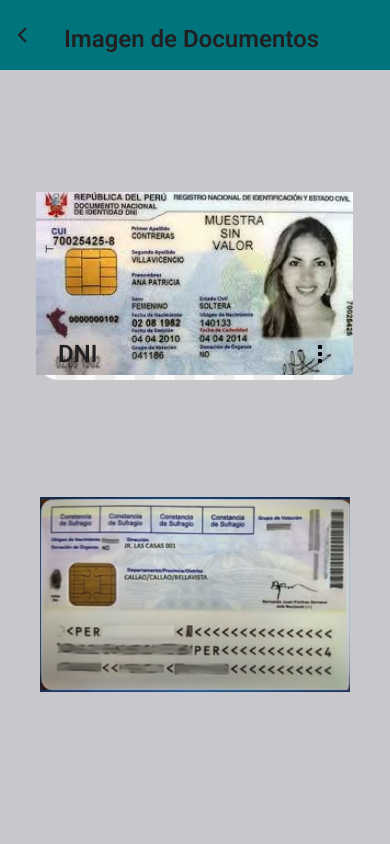
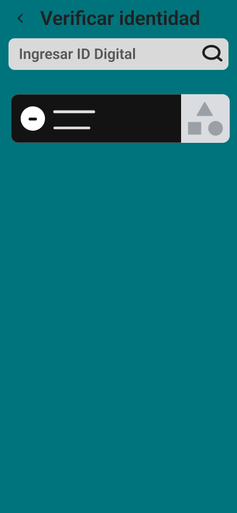

# Capítulo VI: Solution UX Design

## 6.1. Style Guidelines

### 6.1.1. General Style Guidelines

### 6.1.2. Web, Mobile & Devices Style Guidelines

## 6.2. Information Architecture

### 6.2.1. Organization Systems
---
Nuestro landing page está diseñado aplicando principios clave como la jerarquía visual, la organización secuencial y la categorización por tópicos. La jerarquía visual se refleja en el llamado a la acción principal, "Accede a servicios esenciales con tu identidad digital", ubicado en la parte superior, seguido por bloques de contenido claramente diferenciados que destacan las características de SecureID. Cada sección está diseñada para captar la atención y dirigir al usuario hacia las áreas más relevantes de la plataforma.
La organización secuencial guía al usuario de manera lógica a lo largo de la página: comenzamos con una descripción general de la solución, seguida por una explicación de los beneficios específicos (Identidad Digital Segura, Blockchain Privado y Mayor Accesibilidad), y luego se presentan testimonios reales de usuarios satisfechos. Finalmente, el usuario llega al formulario de contacto para obtener más información o registrarse en la plataforma.
La categorización por tópicos es clara y efectiva, dividiendo el contenido en secciones bien definidas como "Identidad Digital Segura", "Blockchain Privado", y "Mayor Accesibilidad", lo que facilita la navegación del usuario según sus intereses. También, la organización matricial se aplica en la sección de testimonios, donde múltiples opiniones de usuarios se presentan de manera simultánea, permitiendo una comparación rápida de diferentes experiencias con el servicio.
Este enfoque garantiza que los visitantes puedan acceder a la información clave de manera eficiente y clara, mejorando la experiencia general del usuario en la plataforma SecureID.

---
### 6.2.2. Labeling Systems
---
Los sistemas de etiquetado se emplean para transmitir información al usuario, permitiendo que su experiencia sea más eficiente y que no pierda tiempo buscando o utilizando la aplicación.

**Aplicación Móvil**

> La aplicación incluye encabezados con letras más grandes para recordar al usuario en qué sección se encuentra, además de detallar los pasos necesarios para continuar navegando en el sistema. Se utilizan términos sencillos para asegurar que cualquier persona pueda entender y usar la aplicación fácilmente.

---
> Menú: muestra las funcionalidades de la aplicación.

---
> Documento de Identidad: muestra los datos personales del usuario.

---
> Imagen de Documentos: muestra una representación visual del documento del usuario.

---
> Servicios: muestra las opciones de servicios disponibles para el usuario.

---
> Historial: muestra una lista de transacciones o acciones previas del usuario.

---
### 6.2.3. Searching Systems
---
Los sistemas de búsqueda de información son fundamentales para que el usuario pueda localizar lo que necesita de forma rápida y efectiva.

**Aplicación Móvil**

> Verificar identidad: permite al usuario buscar por nombre o DNI para confirmar la identidad.

---
### 6.2.4. SEO Tags and Meta Tags
---

**SEO Tags y Meta Tags para la Landing Page de SecureID**
- Title: SecureID – Acceso Seguro a Servicios Esenciales
- Meta Description: Conoce SecureID, la plataforma que te permite gestionar tu identidad digital a través de una blockchain privada y acceder de forma segura a servicios esenciales como educación, salud y asistencia social.
- Meta Keywords: identidad digital segura, blockchain privado, acceso a servicios esenciales, SecureID, inclusión digital
Author: Equipo SecureID

**SEO Tags y Meta Tags para la Aplicación Móvil de SecureID**
- Página Principal
    - Title: SecureID – Tu Identidad Digital para Acceder a Servicios Esenciales
    - Meta Description: Descubre cómo SecureID te ayuda a acceder a servicios esenciales como salud y educación de manera segura y sin barreras, gracias a nuestra tecnología blockchain privada.
    - Meta Keywords: identidad digital, acceso a servicios esenciales, blockchain privado, inclusión digital, SecureID
    - Author: Equipo SecureID

- Sección de Inicio de Sesión y Registro
    - Title: Inicia Sesión o Regístrate - SecureID
    - Meta Description: Accede a tu cuenta de SecureID o regístrate para comenzar a utilizar tu identidad digital y acceder a servicios esenciales.
    - Meta Keywords: iniciar sesión en SecureID, registro SecureID, cuenta SecureID
    - Author: Equipo SecureID

- Sección de Configuración de Identidad Digital
    - Title: Configura Tu Identidad Digital - SecureID
    - Meta Description: Personaliza tu perfil de identidad digital en SecureID para asegurar un acceso optimizado y seguro a servicios esenciales como salud y educación.
    - Meta Keywords: configuración identidad digital, personalización identidad, acceso a servicios, SecureID
    - Author: Equipo SecureID

- Sección de Perfil de Usuario
    - Title: Tu Perfil en SecureID - Gestiona Tu Identidad
    - Meta Description: Gestiona tu perfil en SecureID y ajusta tus preferencias para mejorar tu acceso seguro a servicios esenciales.
    - Meta Keywords: perfil SecureID, configuración de cuenta SecureID, usuario de SecureID
    - Author: Equipo SecureID

- Sección de Agregar Nuevas Identificaciones
    - Title: Añade Nuevas Identificaciones - SecureID
    - Meta Description: Añade nuevas identificaciones digitales en tu cuenta de SecureID y utiliza nuestra tecnología avanzada para acceder a servicios adicionales.
    - Meta Keywords: agregar identidad digital, nueva identificación SecureID, acceso a servicios
    - Author: Equipo SecureID

Estos SEO y meta tags están adaptados para reflejar la misión y los servicios de SecureID, asegurando una optimización adecuada para los motores de búsqueda y una mejor experiencia de usuario.

---
### 6.2.5. Navigation Systems
---

En los sistemas de navegación, los botones son interfaces clave que permiten moverse entre diferentes secciones de la aplicación. Un ejemplo son los botones en la parte superior de la plataforma web y landing page, que facilitan el acceso a distintas funciones. Estos botones incluyen texto que describe claramente su función, permitiendo al usuario moverse rápidamente por la aplicación seleccionando la opción que mejor se ajuste a sus necesidades.

**Landing Page:**

La barra de navegación se encuentra en la parte superior, permitiendo al visitante acceder fácilmente a las siguientes secciones:
- "About SecureID": Muestra información detallada sobre nuestra plataforma, explicando cómo SecureID facilita el acceso seguro a servicios esenciales mediante identidades digitales.
- "About Us": Aquí se presenta información sobre nuestro equipo de desarrollo, junto con testimonios de usuarios que comparten sus experiencias positivas utilizando SecureID.
- "Contact": Esta sección contiene un formulario en el que el visitante puede dejar sus datos de contacto para recibir más información o asistencia sobre el uso de nuestra plataforma.
- "Log In": Redirige al usuario a la página de inicio de sesión, donde podrá acceder a su cuenta en la plataforma SecureID.
- "Register": Lléva al visitante al formulario de registro para crear una cuenta y empezar a usar los servicios de SecureID.

Este esquema de navegación está diseñado para ofrecer una experiencia intuitiva y directa, facilitando el acceso a la información y funcionalidades más importantes de SecureID.

**Aplicación Móvil:**

Sistema de Navegación: En el menú principal de la aplicación, los usuarios pueden acceder a diferentes funcionalidades a través de una lista de opciones. Al hacer clic en "Identidad", los usuarios serán redirigidos a una sección donde podrán verificar o actualizar su información personal. La opción "Licencia de Conducir" lleva a los usuarios a la pantalla para gestionar sus licencias. Al seleccionar "Imagen de Documentos", los usuarios podrán visualizar imágenes de documentos asociados. En "Servicios", se muestra una lista de servicios disponibles para el usuario. Finalmente, "Historial de Transacciones" permite al usuario revisar sus transacciones anteriores dentro del sistema.

---
## 6.3. Landing Page UI Design

### 6.3.1. Landing Page Wireframe

### 6.3.2. Landing Page Mock-up

## 6.4. Applications UX/UI Design

### 6.4.1. Applications Wireframes

### 6.4.2. Applications Wireflow Diagrams

### 6.4.3. Applications Mock-ups

### 6.4.4. Applications User Flow Diagrams

## 6.5. Applications Prototyping