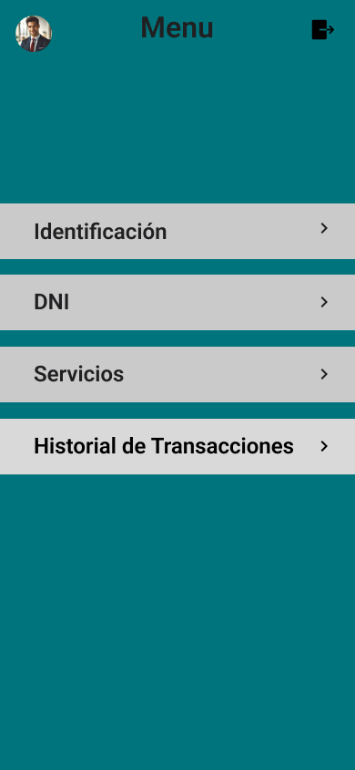
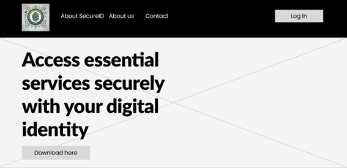
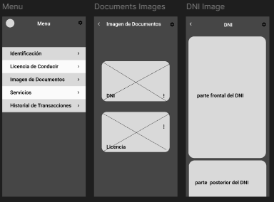

# Capítulo VI: Solution UX Design
---

## 6.1. Style Guidelines
En este apartado, establecemos las directrices fundamentales para garantizar la uniformidad y solidez de la marca SecureID en sus representaciones visuales y comunicacionales. Mantener la coherencia en la aplicación de estos elementos refuerza nuestra identidad de marca y facilita su reconocimiento inmediato por parte de clientes y partes interesadas.

---
### 6.1.1. General Style Guidelines
#### 6.1.1.1. Branding
La marca SecureID representa la integración de tecnología avanzada y el acceso inclusivo a servicios esenciales. Nuestra identidad está alineada con los valores de innovación, inclusión social y eficiencia. Todos los elementos de nuestra imagen de marca están diseñados para comunicar estos principios fundamentales, y deben ser aplicados de forma que preserven la coherencia y fuerza del mensaje.

Para garantizar esta uniformidad, todos los materiales y comunicaciones deben seguir las siguientes pautas:

- Utilizar la paleta de colores oficial de la marca, compuesta por los siguientes tonos: #00747C (verde azulado), #00BBC9 (turquesa), #CACACA (gris claro), #878787 (gris medio) y #202022 (gris oscuro).
- Emplear las tipografías corporativas Roboto para los títulos y Lato para el cuerpo del texto, asegurando una legibilidad óptima y una presentación profesional.
- Seguir los estándares de diseño basados en geometrías limpias y modernas, manteniendo una estética visual armónica y clara.

---
#### 6.1.1.2. Logo
El logotipo de SecureID es un símbolo de nuestro compromiso con la innovación y la eficiencia en el ámbito de la identificación digital. Ofrecemos dos versiones principales del logotipo, adaptadas para su aplicación en distintos contextos.

**Versión del Logo**

{ width=30% }

Esta versión del logotipo está diseñada para su uso tanto en fondos oscuros como claros, donde el contraste optimiza su impacto visual. Los elementos gráficos y tipográficos mantienen su integridad, sin modificaciones en color o forma, garantizando una apariencia coherente en cualquier contexto.

---
#### 6.1.1.3. Typography
La tipografía de SecureID ha sido cuidadosamente elegida para reflejar la innovación y accesibilidad de nuestra marca. Mantener un uso consistente de estas fuentes asegura la uniformidad y el reconocimiento en todas nuestras comunicaciones.

**Encabezados**: Usamos 'Roboto', una tipografía geométrica sans-serif que transmite modernidad y profesionalismo. Esta fuente se emplea para títulos y subtítulos.

**Texto Corporal**: 'Lato' es la tipografía estándar para el cuerpo de texto. Proporciona una lectura clara en diversos tamaños, siendo ideal para párrafos y descripciones detalladas.

Las fuentes deben aplicarse con los siguientes pesos para garantizar una jerarquía visual adecuada y una óptima legibilidad:

- **Roboto**: Semi-Bold (600) para encabezados.
- **Lato**: Regular (400) para el cuerpo de texto y Light (300) para subtítulos o texto secundario.

---
#### 6.1.1.4. Colors
Los colores de la marca SecureID han sido seleccionados con precisión para transmitir tecnología, confianza y modernidad:

- **Verde Azulado** (#00747C): Evoca profesionalismo y seguridad en nuestros servicios.
- **Turquesa** (#00BBC9): Refleja innovación y accesibilidad.
- **Gris Claro** (#CACACA): Comunica neutralidad y equilibrio, ideal para fondos y elementos de soporte.
- **Gris Medio** (#878787): Aporta sofisticación y estabilidad, representando vanguardia tecnológica.
- **Gris Oscuro** (#202022): Proporciona un fuerte contraste, destacando elementos clave y asegurando claridad visual.

Estos colores deben aplicarse de manera armoniosa para preservar la coherencia visual y adaptarse a distintos entornos sin comprometer la identidad de la marca.

{ width=30% }

---
#### 6.1.1.5. Spacing
El uso del espaciado es crucial para crear composiciones claras y ordenadas, facilitando la navegación y comprensión del contenido. Las guías de espaciado que seguimos son las siguientes:

- **Margen y Relleno**: Debe haber un margen mínimo de 15px alrededor de los elementos de contenido para asegurar su claridad y legibilidad.
- **Separación entre Elementos**: Se recomienda un espaciado de 10px entre elementos relacionados para agruparlos visualmente y 20px para separar secciones o elementos diferentes.

---
#### 6.1.1.6. Lenguaje Común
Nuestro logo no es solo una imagen; es la representación visual de nuestra esencia y nuestras promesas como marca. Transmite no solo nuestra identidad, sino también nuestro compromiso con la innovación, la seguridad y la inclusión digital a través de la tecnología.

- **Innovación**: El diseño del logo refleja una integración de la tecnología avanzada en la identificación digital, destacando nuestro enfoque vanguardista para resolver problemas de acceso a servicios esenciales.
- **Conectividad**: Los circuitos alrededor del logo simbolizan nuestra promesa de conectar a las personas con servicios clave a través de identificaciones digitales eficientes y seguras.
- **Confianza**: Los tonos de gris y los detalles del logo proyectan estabilidad y solidez, asegurando a nuestros usuarios que están tomando la decisión correcta al utilizar SecureID.
- **Calidad**: Cada línea y detalle del logo ha sido cuidadosamente diseñado para transmitir precisión y profesionalismo, reflejando nuestro compromiso con la calidad y la perfección técnica.
- **Accesibilidad**: El esquema de colores y la estructura equilibrada del logo refuerzan nuestro objetivo de proporcionar soluciones accesibles y universales, independientemente de las barreras geográficas o sociales.

---
### 6.1.2. Web, Mobile & Devices Style Guidelines

**Estándares Visuales**
- Paleta de colores: La paleta de colores establece los tonos que se emplearán en todas las interfaces:
    - Verde oscuro (#00747C).
    - Turquesa (#00BBC9).
    - Gris claro (#CACACA).
    - Gris medio (#878787).
    - Gris oscuro (#202022).
-   Tipografía: Las fuentes seleccionadas aseguran legibilidad en todos los tamaños de pantalla:
    - Encabezados: Roboto, Semi-Bold (600).
    - Texto corporal: Lato, Regular (400) y Light (300).
- Imágenes: Todas las imágenes deben ser de alta calidad y pertinentes al contenido de la interfaz, preferiblemente con licencia o de propiedad propia.

**Espaciado**
- Composiciones: Las interfaces deben ser limpias, organizadas y fáciles de navegar. Guías de espaciado:
    - Margen y relleno: Mínimo de 15px alrededor de los elementos.
    - Separación entre elementos: 10px entre elementos relacionados y 20px entre secciones o elementos distintos.

**Estándares de Interacción**
- Diseño adaptable: Las interfaces deben ser responsivas y ajustarse a diferentes dispositivos, desde computadoras de escritorio hasta móviles.
- Interacciones táctiles: Los elementos interactivos deben estar diseñados para ser utilizados fácilmente con los dedos, con botones de tamaño adecuado para facilitar su pulsación.
- Accesibilidad: Las interfaces deben ser accesibles para usuarios con diversas discapacidades, aplicando técnicas como el alto contraste y texto alternativo para garantizar accesibilidad en todos los contextos.

---
## 6.2. Information Architecture

### 6.2.1. Organization Systems
---
Nuestro landing page está diseñado aplicando principios clave como la jerarquía visual, la organización secuencial y la categorización por tópicos. La jerarquía visual se refleja en el llamado a la acción principal, "Accede a servicios esenciales con tu identidad digital", ubicado en la parte superior, seguido por bloques de contenido claramente diferenciados que destacan las características de SecureID. Cada sección está diseñada para captar la atención y dirigir al usuario hacia las áreas más relevantes de la plataforma.
La organización secuencial guía al usuario de manera lógica a lo largo de la página: comenzamos con una descripción general de la solución, seguida por una explicación de los beneficios específicos (Identidad Digital Segura, Blockchain Privado y Mayor Accesibilidad), y luego se presentan testimonios reales de usuarios satisfechos. Finalmente, el usuario llega al formulario de contacto para obtener más información o registrarse en la plataforma.
La categorización por tópicos es clara y efectiva, dividiendo el contenido en secciones bien definidas como "Identidad Digital Segura", "Blockchain Privado", y "Mayor Accesibilidad", lo que facilita la navegación del usuario según sus intereses. También, la organización matricial se aplica en la sección de testimonios, donde múltiples opiniones de usuarios se presentan de manera simultánea, permitiendo una comparación rápida de diferentes experiencias con el servicio.
Este enfoque garantiza que los visitantes puedan acceder a la información clave de manera eficiente y clara, mejorando la experiencia general del usuario en la plataforma SecureID.

---
### 6.2.2. Labeling Systems
---
Los sistemas de etiquetado se emplean para transmitir información al usuario, permitiendo que su experiencia sea más eficiente y que no pierda tiempo buscando o utilizando la aplicación.

**Aplicación Móvil**

> La aplicación incluye encabezados con letras más grandes para recordar al usuario en qué sección se encuentra, además de detallar los pasos necesarios para continuar navegando en el sistema. Se utilizan términos sencillos para asegurar que cualquier persona pueda entender y usar la aplicación fácilmente.

---
> Menú: muestra las funcionalidades de la aplicación.

---
> Documento de Identidad: muestra los datos personales del usuario.

---
> Imagen de Documentos: muestra una representación visual del documento del usuario.

---
> Servicios: muestra las opciones de servicios disponibles para el usuario.

---
> Historial: muestra una lista de transacciones o acciones previas del usuario.

---
### 6.2.3. Searching Systems
---
Los sistemas de búsqueda de información son fundamentales para que el usuario pueda localizar lo que necesita de forma rápida y efectiva.

**Aplicación Móvil**

> Verificar identidad: permite al usuario buscar por nombre o DNI para confirmar la identidad.

---
### 6.2.4. SEO Tags and Meta Tags
---

**SEO Tags y Meta Tags para la Landing Page de SecureID**
- Title: SecureID – Acceso Seguro a Servicios Esenciales
- Meta Description: Conoce SecureID, la plataforma que te permite gestionar tu identidad digital a través de una blockchain privada y acceder de forma segura a servicios esenciales como educación, salud y asistencia social.
- Meta Keywords: identidad digital segura, blockchain privado, acceso a servicios esenciales, SecureID, inclusión digital
Author: Equipo SecureID

**SEO Tags y Meta Tags para la Aplicación Móvil de SecureID**
- Página Principal
    - Title: SecureID – Tu Identidad Digital para Acceder a Servicios Esenciales
    - Meta Description: Descubre cómo SecureID te ayuda a acceder a servicios esenciales como salud y educación de manera segura y sin barreras, gracias a nuestra tecnología blockchain privada.
    - Meta Keywords: identidad digital, acceso a servicios esenciales, blockchain privado, inclusión digital, SecureID
    - Author: Equipo SecureID

- Sección de Inicio de Sesión y Registro
    - Title: Inicia Sesión o Regístrate - SecureID
    - Meta Description: Accede a tu cuenta de SecureID o regístrate para comenzar a utilizar tu identidad digital y acceder a servicios esenciales.
    - Meta Keywords: iniciar sesión en SecureID, registro SecureID, cuenta SecureID
    - Author: Equipo SecureID

- Sección de Configuración de Identidad Digital
    - Title: Configura Tu Identidad Digital - SecureID
    - Meta Description: Personaliza tu perfil de identidad digital en SecureID para asegurar un acceso optimizado y seguro a servicios esenciales como salud y educación.
    - Meta Keywords: configuración identidad digital, personalización identidad, acceso a servicios, SecureID
    - Author: Equipo SecureID

- Sección de Perfil de Usuario
    - Title: Tu Perfil en SecureID - Gestiona Tu Identidad
    - Meta Description: Gestiona tu perfil en SecureID y ajusta tus preferencias para mejorar tu acceso seguro a servicios esenciales.
    - Meta Keywords: perfil SecureID, configuración de cuenta SecureID, usuario de SecureID
    - Author: Equipo SecureID

- Sección de Agregar Nuevas Identificaciones
    - Title: Añade Nuevas Identificaciones - SecureID
    - Meta Description: Añade nuevas identificaciones digitales en tu cuenta de SecureID y utiliza nuestra tecnología avanzada para acceder a servicios adicionales.
    - Meta Keywords: agregar identidad digital, nueva identificación SecureID, acceso a servicios
    - Author: Equipo SecureID

Estos SEO y meta tags están adaptados para reflejar la misión y los servicios de SecureID, asegurando una optimización adecuada para los motores de búsqueda y una mejor experiencia de usuario.

---
### 6.2.5. Navigation Systems
---

En los sistemas de navegación, los botones son interfaces clave que permiten moverse entre diferentes secciones de la aplicación. Un ejemplo son los botones en la parte superior de la plataforma web y landing page, que facilitan el acceso a distintas funciones. Estos botones incluyen texto que describe claramente su función, permitiendo al usuario moverse rápidamente por la aplicación seleccionando la opción que mejor se ajuste a sus necesidades.

**Landing Page:**

La barra de navegación se encuentra en la parte superior, permitiendo al visitante acceder fácilmente a las siguientes secciones:
- "About SecureID": Muestra información detallada sobre nuestra plataforma, explicando cómo SecureID facilita el acceso seguro a servicios esenciales mediante identidades digitales.
- "About Us": Aquí se presenta información sobre nuestro equipo de desarrollo, junto con testimonios de usuarios que comparten sus experiencias positivas utilizando SecureID.
- "Contact": Esta sección contiene un formulario en el que el visitante puede dejar sus datos de contacto para recibir más información o asistencia sobre el uso de nuestra plataforma.
- "Log In": Redirige al usuario a la página de inicio de sesión, donde podrá acceder a su cuenta en la plataforma SecureID.
- "Register": Lléva al visitante al formulario de registro para crear una cuenta y empezar a usar los servicios de SecureID.

Este esquema de navegación está diseñado para ofrecer una experiencia intuitiva y directa, facilitando el acceso a la información y funcionalidades más importantes de SecureID.

**Aplicación Móvil:**

Sistema de Navegación: En el menú principal de la aplicación, los usuarios pueden acceder a diferentes funcionalidades a través de una lista de opciones. Al hacer clic en "Identidad", los usuarios serán redirigidos a una sección donde podrán verificar o actualizar su información personal. La opción "Licencia de Conducir" lleva a los usuarios a la pantalla para gestionar sus licencias. Al seleccionar "Imagen de Documentos", los usuarios podrán visualizar imágenes de documentos asociados. En "Servicios", se muestra una lista de servicios disponibles para el usuario. Finalmente, "Historial de Transacciones" permite al usuario revisar sus transacciones anteriores dentro del sistema.

---
## 6.3. Landing Page UI Design
---
### 6.3.1. Landing Page Wireframe
---

En esta sección se presentará el diseño del sitio web de nuestro software, proporcionando una visión clara del contenido que aparecerá en la plataforma. La landing page está optimizada para pantallas de ordenadores, con la información centrada para asegurar una fácil visualización. Además, cuenta con una barra de navegación que mejora la experiencia del usuario, facilitando el acceso a las distintas secciones del sitio.

- Menú principal de la plataforma: Opciones de navegación

---
- About SecureID: Es una sección del menú principal

---
- About Us: Es una sección del menú principal

---
- Opinions: Es una sección del menú principal

---
- Contact: Es una sección del menú principal

---
- Footer:

---

> Enlace del Figma del Landing Page: https://www.figma.com/design/wW9tsqZq7kXYhC3lryzsVY/Landing-Page-UI-Desing?node-id=0-1&t=sRN4Ch23zqnpKlm3-1 

---
### 6.3.2. Landing Page Mock-up
---

Se presentará una vista preliminar del sitio web, detallando el contenido por secciones, los colores, estilos e imágenes, todos alineados con el propósito del sitio para ofrecer al usuario una experiencia más fluida y comprensible sobre el objetivo del mismo.

- Elementos Clave
    - Principios de diseño: Se aplicaron principios clave como jerarquía, equilibrio, contraste, repetición y ritmo para crear una página atractiva, fácil de usar y funcional.
    - Elementos de diseño: Se emplearon diversos elementos como tipografía, colores, imágenes e iconos para generar un diseño visualmente atractivo y coherente.
    - Diseño inclusivo: Se consideraron principios de diseño inclusivo para asegurar que la página sea accesible para todos los usuarios, garantizando una experiencia equitativa.

---

> Enlace del Landing Page Desplegado: https://idblock-wx83.github.io/landing-page/ 

---
## 6.4. Applications UX/UI Design

### 6.4.1. Applications Wireframes

### 6.4.2. Applications Wireflow Diagrams

### 6.4.3. Applications Mock-ups

#### Login:

#### Registro:

#### Menu:

#### Documento de identidad virtual:

#### DNI Imagen:

#### Servicios:

#### Pantallas creadas:

### 6.4.4. Applications User Flow Diagrams

## 6.5. Applications Prototyping

### Link: https://www.figma.com/proto/66fO5Iskayzuy5JR6wPjyu/Wireframes?page-id=18%3A12&node-id=18-14&node-type=canvas&viewport=738%2C446%2C0.13&t=Fe5wxQeIqH68WpkW-1&scaling=scale-down&content-scaling=fixed&starting-point-node-id=18%3A14 