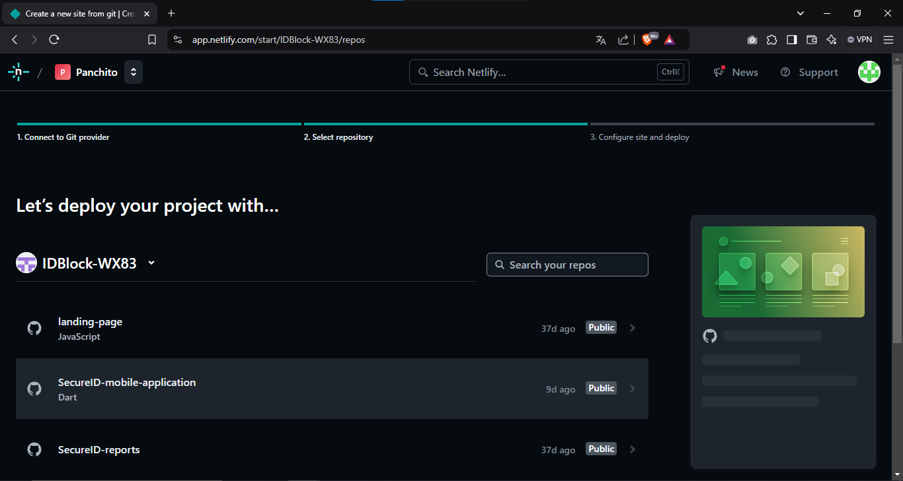

# Capítulo VII: Product Implementation, Validation & Deployment
---

## 7.1. Software Configuration Management
### 7.1.1. Software Development Environment Configuration
---
Este segmento describe los programas de software esenciales para facilitar la colaboración en el ciclo de vida de los productos digitales dentro del proyecto. Se mencionan los nombres de los programas, su función en el proyecto, y los enlaces o rutas de descarga correspondientes para su acceso.

**Visual Studio Code**

> Este entorno de desarrollo se empleará para crear tanto la landing page como la aplicación móvil. Flutter será utilizado para el desarrollo de la parte móvil.

Link: https://code.visualstudio.com/download

**Github**

> Esta herramienta se empleará para administrar el control de versiones en todos nuestros repositorios.

Link: https://github.com/

**Figma**

> Esta plataforma se utiliza para diseñar los prototipos de nuestra aplicación móvil.

Link: https://www.figma.com/

**Firebase App Distribution**

> Esta herramienta facilita la distribución de versiones de aplicaciones móviles.

Link: https://firebase.google.com/docs/app-distribution?hl=es

**Railway**

> Se utilizará para realizar el despliegue del servicio backend.

Link: https://railway.app/

**Miro**

> Se emplea para llevar a cabo sesiones de brainstorming y para partes específicas del informe, como el análisis del escenario actual y el escenario futuro deseado.

Link: https://miro.com/es/

**Uxpressia**

> Se utiliza para ilustrar las secciones relacionadas con el Needfinding.

Link: https://uxpressia.com/

**Lucidchart**

> Se emplea para la elaboración de diagramas de clases y diagramas de bases de datos.

Link: https://www.lucidchart.com/pages

**Visual Paradigm**

> Se utiliza para diseñar la arquitectura de software de nuestro proyecto.

Link: https://www.visual-paradigm.com/

### 7.1.2. Source Code Management
---
**Landing Page**

Link: https://github.com/IDBlock-WX83/landing-page

----

**Convenciones de GitHub**

> The main branch:

El modelo de desarrollo se fundamenta en prácticas bien definidas. El repositorio central cuenta con dos ramas principales de duración indefinida:

*   master: Esta rama, conocida por todos los usuarios de Git, representa un estado listo para producción.
*   develop: En paralelo a master, la rama develop contiene los últimos cambios en desarrollo para la próxima versión. Funciona como la rama de integración y es donde se generan las compilaciones automáticas diarias.

Una vez que el código en la rama develop se estabiliza y está listo para ser lanzado, todos los cambios se fusionan en master y se etiquetan con un número de versión. De este modo, cada fusión en master marca un nuevo lanzamiento de producción, lo que facilita la automatización del despliegue de software.

> Feature branches:

Bifurcadas desde: develop
Fusionadas de nuevo en: develop
Convención de nombres: Cualquier nombre, excepto master, develop, release-, o hotfix-

Las ramas de características, también llamadas ramas de temas, se utilizan para desarrollar nuevas funcionalidades, ya sea para lanzamientos cercanos o futuros. Estas ramas se mantienen activas hasta que la nueva funcionalidad esté lista para integrarse en la rama develop o se descarta si resulta no ser adecuada.

### 7.1.3. Source Code Style Guide & Conventions
---

Como convención general, todo el código realizado por los miembros del equipo debe redactarse en
completo inglés.

**HTML**

Use Lowercase Element Names: Se recomienda usar lowercase para los nombres de los elementos HTML.

Close All HTML Elements: Se recomienda cerrar todos los elementos HTML.

Use Lowercase Attribute Names: Se recomienda usar lowercase para los nombres de los atributos HTML.

Always Specify alt, width, and height for Images: Se recomienda seguir estas convenciones en caso de que la imagen no se puede mostrar y ayudar con la accesibilidad del contenido.

Spaces and Equal Signs: Se recomienda no usar espacios en blanco entre las entidades para una mejor lectura.

Para más información sobre las convenciones de HTML se usará como referencia:
https://www.w3schools.com/html/html5_syntax.asp

**CSS**

ID and Class Naming: Usar nombres de clases e ID significativos que expresen el propósito del elemento.

ID and Class Name Style: Usar nombres cortos para nombrar ID o clases, pero lo suficientemente largo para saber cuál es su
propósito.

Shorthand Properties: Usar CSS shothand properties tanto como sea posible para que el código sea más eficiente y entendible.

ID and Class Name Delimiters: Separar las palabras en ID y clases con un guión.

Selector and Declaration Separation: Separar los selectores y declaraciones en nuevas líneas.

Para más información sobre las convenciones de CSS se usará como referencia:
https://google.github.io/styleguide/htmlcssguide.html#CSS

**JavaScript**

Use expanded syntax: Cada línea de JavaScript en una nueva línea, con la llave de apertura en la misma línea de su
declaración y la llave de cierre en una nueva línea al final.

Variable naming: Para el nombre de las variables usar lowerCamelCase.

Declaring variables: Para la declaración de variables usar las palabras reservadas let y const, no usar var.

Use strict equality: Siempre usar la igualdad o inigualdad estricta.

Function naming: Para el nombre de las funciones usar lowerCamelCase.

Para más información sobre las convenciones de JavaScript se usará como referencia:
https://www.w3schools.com/js/js_conventions.asp

**TypeScript**

Camel case: Usar camelCase cuando nombramos variables y funciones. También se debe usar camelCase en los miembros de una clase y sus métodos. En la interface, el camelCase se usa para nombrar miembros.

Pascal case: Usar pascal case para nombres de clases. En la interface, sirve para nombres.

Para más información sobre las convenciones de TypeScript se usará como referencia:
https://basarat.gitbook.io/typescript/styleguide#array

**Gherkin**

Discernible Given-When-Then Blocks: Se recomienda aplicar sangría a los bloques, para saber cuándo iniciar y terminan.

Steps with Tables: Si necesitamos entrada de una tabla en nuestros pasos, para que sea reconocible, añadiremos dos puntos al final del paso.

Reducing Noise: Se recomienda usar valores predeterminados para campos que requiere el software pero que no son relevantes para el escenario.

 
Parameters in Steps: Para el ejemplo anterior, se pudo notar la inclusión de comillas simples para los parámetros en un paso, lo cual facilita la detección de estos.

Newlines within Scenarios: En caso de que el escenario se está alargando, es recomendable agregar nuevas líneas entre cada paso para que los bloques sean más legibles.

 
Newlines between scenarios and separator comments: Cuando se tienen muchos escenarios, se vuelve difícil saber el punto donde inicia o termina otro. Por ello, se recomiendo agregar una línea de separación entre escenario y un separador de comentarios.

### 7.1.4. Software Deployment Configuration.
---
Esta sección describe la configuración requerida para realizar correctamente el despliegue de cada uno de los productos digitales en la solución, utilizando las herramientas específicas para cada caso.

**Despliegue de la Landing Page**

Para el despliegue de la Landing Page, se utilizará la plataforma Netlify. A continuación, se detallan los pasos necesarios:

- Configuración del Repositorio: El código fuente de la Landing Page y la Aplicación Web se almacenará en un repositorio en la plataforma Github.
- Creación del Sitio en Netlify: Se creará un nuevo sitio en Netlify vinculado al repositorio que contiene el código fuente de la Landing Page y la Aplicación Web.
- Configuración de Build y Deploy: Netlify proporciona una integración continua (CI/CD) automatizada.
- Configuración de Dominio Personalizado: Opcionalmente, se puede configurar un dominio personalizado para el sitio web desplegado en Netlify.

**Despliegue de la Aplicació Móvil en Firebase App Distribution**

Para el despliegue de la aplicación en Firebase App Distribution, se seguirán los siguientes pasos:

-   Configuración del Repositorio: El código fuente de la aplicación se almacenará en un repositorio en GitHub, asegurando que esté actualizado con la última versión lista para pruebas.
-   Integración con Firebase: Conectar Firebase App Distribution al proyecto de la aplicación móvil, permitiendo la distribución de las versiones beta a los testers.
-   Configuración de Build y Deploy: Configurar una pipeline de integración continua (CI/CD) con herramientas como Fastlane o GitHub Actions para automatizar la creación de nuevas versiones y su despliegue en Firebase App Distribution.
-   Distribución de la Aplicación: Subir la APK o IPA directamente a Firebase App Distribution, donde los testers seleccionados recibirán una notificación con acceso a la nueva versión.
-   Gestión de Testers: Gestionar los testers desde Firebase, añadiéndolos o eliminándolos según sea necesario, para asegurar que las personas correctas tengan acceso a las versiones.

**Despliegue del Web Service**

Para el despliegue del Web Service, se utilizará la plataforma Railway. A continuación, se detallan los pasos necesarios:

- Configuración del Repositorio: El código fuente del Web Service se almacenará en un repositorio en la plataforma Github.
- Creación del Proyecto en Railway: Se creará un nuevo proyecto en Railway vinculado al repositorio que contiene el código fuente del Web Service.
- Configuración de Variables de Entorno: Railway permite configurar fácilmente variables de entorno para el proyecto. Se configurarán las variables de entorno necesarias, como credenciales de base de datos u otras configuraciones específicas del entorno.
- Despliegue Automatizado: Una vez configurado el proyecto en Railway, se puede habilitar el despliegue automático para que el servicio se actualice automáticamente cada vez que se realicen cambios en el repositorio.
- Monitoreo y Escalado: Railway proporciona herramientas para monitorear el rendimiento del servicio y escalarlo según sea necesario, asegurando un funcionamiento óptimo en todo momento.

## 7.2. Solution Implementation
### 7.2.1. Sprint 1
#### 7.2.1.1. Sprint Planning 1
---
| Sprint#        | Sprint 1                      |
|----------------|-------------------------------|
| **Sprint Planning Background** |   |
| Date           | 01/11/2024                    |
| Time           | 11:00 pm                      |
| Location       | Google meet                   |
| Prepared By    | Aldo Pastrana |
| Attendees (to planning meeting) | Aldo Pastrana / Anderson Ore / Max Sabino / Sebastian Hernandez / Rodrigo López |
| **Sprint n-1 Review Summary** | Este es el primer sprint, no hay reviews anteriores. |
| **Sprint n-1 Retrospective Summary** | El equipo usará HTML, CSS y JavaScript para el desarrollo del Landing Page y Flutter para el desarrollo de la Aplicación Móvil |
| **Sprint Goal & User Stories** |   |
| Sprint n Goal  | Realizar el desarrollo del Landing Page y Aplicación Móvil |
| Sprint n Velocity | 14 |
| Sum of story Points | 63 |

#### 7.2.1.2. Sprint Backlog 1
---
<table>
    <tr>
        <th colspan="1">Sprint #</th>
        <th colspan="5">Sprint n</th>
    </tr>
    <tr>
     <th colspan="2">User Story</th>
        <th colspan="6">Work-Item / Task</th>
    </tr>
    <tr>
        <td>Id</td>
        <td>Title</td>
        <td>Id</td>
        <td>Title</td>
        <td>Description</td>
        <td>Estimation (Hours)</td>
        <td>Assigned To</td>
        <td>Status (To-do / In-Process / To-Review Done)</td>
    </tr>
    <tr>
        <td>US17</td>
        <td>Visualización de la Propuesta de Valor</td>
        <td>TK01</td>
        <td>Visualización de la Propuesta de Valor</td>
        <td>Como visitante de la landing page, quiero entender rápidamente la propuesta de valor de
SecureID para saber cómo esta plataforma puede ayudarme a obtener una identificación
digital segura.</td>
        <td>1</td>
        <td>Aldo Pastrana</td>
        <td>Done</td>
    </tr>
    <tr>
        <td>US18</td>
        <td>Información sobre los Beneficios de SecureID</td>
        <td>TK01</td>
        <td>Información sobre los Beneficios de SecureID</td>
        <td>Como residente de una zona rural, quiero conocer los beneficios de usar SecureID para
entender cómo puede mejorar mi acceso a servicios esenciales.</td>
        <td>1</td>
        <td>Anderson Ore</td>
        <td>Done</td>
    </tr>
    <tr>
        <td>US19</td>
        <td>Información sobre Integración con Sistemas Gubernamentales</td>
        <td>TK01</td>
        <td>Información sobre Integración con Sistemas Gubernamentales</td>
        <td>Como autoridad local, quiero ver información sobre cómo SecureID se integra con los
sistemas gubernamentales para asegurarme de que puede ser implementado fácilmente
en mi comunidad.</td>
        <td>1</td>
        <td>Max Sabino</td>
        <td>Donei</td>
    </tr>
    <tr>
        <td>US20</td>
        <td>Acceso a Recursos Educativos</td>
        <td>TK01</td>
        <td>Acceso a Recursos Educativos</td>
        <td>Como residente de una zona rural, quiero acceder a recursos educativos en la plataforma
SecureID para aprender a utilizarla de manera efectiva.</td>
        <td>1</td>
        <td>Sebastian Hernandez</td>
        <td>Done</td>
    </tr>
    <tr>
        <td>US21</td>
        <td>Llamado a la Acción para Registro</td>
        <td>TK01</td>
        <td>Llamado a la Acción para Registro</td>
        <td>Como visitante de la landing page, quiero ver un claro llamado a la acción para
registrarme en SecureID y comenzar a utilizar la plataforma.</td>
        <td>1</td>
        <td>Rodrigo López</td>
        <td>Done</td>
    </tr>
    <tr>
        <td>US22</td>
        <td>Optimización para Dispositivos Móviles</td>
        <td>TK01</td>
        <td>Optimización para Dispositivos Móviles</td>
        <td>Como visitante de la landing page, quiero que la página esté optimizada para dispositivos
móviles para poder navegarla cómodamente desde mi teléfono o tableta.</td>
        <td>1</td>
        <td>Aldo Pastrana</td>
        <td>Done</td>
    </tr>
    <tr>
        <td>US01</td>
        <td>Registro de Identificación Digital</td>
        <td>TK01</td>
        <td>Registro de Identificación Digital</td>
        <td>Como residente de la zona rural, quiero registrar mi identificación digital en la plataforma
SecureID para acceder a servicios esenciales como salud, educación y asistencia social.</td>
        <td>1</td>
        <td>Anderson Ore</td>
        <td>Done</td>
    </tr>
    <tr>
        <td>US02</td>
        <td>Verificación de Identidad</td>
        <td>TK01</td>
        <td>Verificación de Identidad</td>
        <td>Como autoridad local, quiero verificar la identidad digital de los residentes a través de la
plataforma SecureID para asegurarme de que pueden acceder a los recursos y servicios sin
fraude.</td>
        <td>2</td>
        <td>Max Sabino</td>
        <td>Done</td>
    </tr>
    <tr>
        <td>US03</td>
        <td>Acceso a Servicios Esenciales</td>
        <td>TK01</td>
        <td>Acceso a Servicios Esenciales</td>
        <td>Como residente de la zona rural, quiero acceder a servicios como salud, educación y
asistencia social a través de la plataforma SecureID utilizando mi identificación digital.</td>
        <td>2</td>
        <td>Sebastian Hernandez</td>
        <td>Done</td>
    </tr>
    <tr>
        <td>US06</td>
        <td>Integración con Servicios Gubernamentales</td>
        <td>TK01</td>
        <td>Integración con Servicios Gubernamentales</td>
        <td>Como autoridad local, quiero que la plataforma SecureID esté integrada con los sistemas
gubernamentales existentes para que pueda gestionar y verificar identidades de manera
más eficiente.</td>
        <td>2</td>
        <td>Rodrigo López</td>
        <td>Done</td>
    </tr>
    <tr>
        <td>US07</td>
        <td>Interfaz de Usuario Accesible</td>
        <td>TK01</td>
        <td>Interfaz de Usuario Accesible</td>
        <td>Como residente de la zona rural con bajo nivel de alfabetización digital, quiero una interfaz
de usuario que sea simple y fácil de usar para que pueda gestionar mi identificación digital
sin dificultad.</td>
        <td>1</td>
        <td>Aldo Pastrana</td>
        <td>Done</td>
    </tr>
</table>

#### 7.2.1.3. Development Evidence for Sprint Review
---
| Repository          | Branch            | Commit Id | Commit Message           | Commit Message Body                                  | Committed on (Date) |
|---------------------|-------------------|-----------|--------------------------|------------------------------------------------------|---------------------|
| https://github.com/IDBlock-WX83/landing-page | main | 25c01e5d268b9ab220ac25770029a360b5cb652b  | update title | update title | 01/11/2024         |
| https://github.com/IDBlock-WX83/landing-page | main | 642bf896b8b44947bd7334d5fa9dd19cbe4f7974  | Update index.html | Update index.html | 01/11/2024         |
| https://github.com/IDBlock-WX83/landing-page | main | 92c68a7af8d002b08451fb86e6ef95d1dfa68a97  | Update index.html | Update index.html | 01/11/2024         |
| https://github.com/IDBlock-WX83/landing-page | main | d0f5a95cb84613b5f52d7076dfc2eb81af0c4586  | first commit | first commit | 25/09/2024         |
| https://github.com/IDBlock-WX83/landing-page | main | 0da8bbea46cc7d52a1f870e15a67cd9488566f9c  | añadiendo vistas de colaboradores y beneficios | añadiendo vistas de colaboradores y beneficios | 01/11/2024         |
| https://github.com/LosChiferos-WS71/ztech-web-application | main | bf09cbdeb2e922b3fda8b3ac3d78e602e746d96c  | feat: Add project basis | Agregar proyecto basse | 03/05/2024         |
| https://github.com/LosChiferos-WS71/ztech-web-application | main | e63f61ebded0c7abfa3c3fdd2b47a010f4c9fe4a  | add register view | Agregar vista de registro | 03/05/2024         |
| https://github.com/LosChiferos-WS71/ztech-web-application | main | 3acc2160e49f47adfd010fad6ff8125fa4afdf83  | Add Application Web | Agregar vista de login | 03/05/2024         |
| https://github.com/LosChiferos-WS71/ztech-web-application | main | 90f78a2b77cbca2ccb9507e72a80e4f926751591  | feat(add): Add component home without css | Agregar component home con CSS | 03/05/2024         |
| https://github.com/LosChiferos-WS71/ztech-web-application | main | 31c2c0791d2a0cfc0ccbb0dfa62dcb7b5232460a  | add register styles | Agregar estilos de la vista registro | 03/05/2024         |

#### 7.2.1.4. Testing Suite Evidence for Sprint Review
---
Para esta entrega no se ha presentado un backend funcional, se presento un fake API, por lo que los unit tests, integration tests y acceptance tests automaizados, para
web services relacionados con los user stories no realizara en esta entrega.

#### 7.2.1.5. Execution Evidence for Sprint Review
---
> Se realizó el landing page enfocado a nuestra propuesta como startup, evidenciando nuestro compromiso como equipo. 
Las tareas a realizar en cada sprint para la elaboración del landing page fueron:
- Planteamiento y desarrollo sobre nuestros componentes de estrategia empresarial como lo que es la presentacion de las ofertas y ventajas del servicio de SecureID.
-  Ofrecemos una descripción general del servicio, luego detallamos las características específicas del producto, y finalmente presentamos testimonios y un formulario de contacto.
- Presentamos información en secciones bien definidas lo cual facilita la navegación del usuario por áreas de interés específicas.

#### 7.2.1.6. Services Documentation Evidence for Sprint Review
---
La landing page y aplicación móvil de nuestro proyecto se desarrollaron utilizando el sistema de control de versiones de Git, lo cual se puede verificar en el repositorio correspondiente del proyecto respectivamente: https://github.com/IDBlock-WX83/landing-page https://github.com/IDBlock-WX83/SecureID-mobile-application 

- Por otro lado, utilizamos HTML, CSS, JavaScript para realizar la página de nuestro landing page.

- Asimismo, utilizamos Flutter para realizar las interfaces de nuestra aplicación móvil.

#### 7.2.1.7. Software Deployment Evidence for Sprint Review
---
En este Sprint, se ha completado el despliegue de la landing page. Esto ha implicado la creación de cuentas, la configuración de recursos en proveedores de nube y la configuración de proyectos de desarrollo para la integración.

Hemos seguido los mismos pasos para los dos despliegues.

1. Crear una cuenta en Netlify:
Acceder a https://www.netlify.com/ y nos creamos una cuenta

|

2. Conectar Netlify con el repositorio:
En Netlify, hacer clic en "New site".
Seleccionar "Import from Git".
Conectar la cuenta de GitHub.
Seleccionamos el repositorio que contiene nuestra landing page y aplicación web.
Hacer clic en "Deploy site".

|

3. Configurar el sitio web:
Netlify te asignará una URL temporal a nuestro sitio web.

|

4. Desplegar el sitio web:
Cuando hemos realizado todos los cambios necesarios, hacer clic en "Deploy".

|

#### 7.2.1.8. Team Collaboration Insights during Sprint
---

**Landing Page**

Hemos desarrollado la implementacion de la Landing Page en ramas de la siguiente manera

## 7.3. Validation Interviews
---

### 7.3.1. Diseño de Entrevistas

**Objetivo de la Entrevista**

Evaluar la efectividad, usabilidad y percepción de seguridad de SecureID en su landing page, aplicación web, centrándonos en las principales funcionalidade y la percepción del usuario sobre la tecnología blockchain aplicada a la identificación digital.

> Elementos a Incluir en la Sesión de Validación para el segmento objetivo “Residentes”.

1. Landing Page de SecureID

-   Presentación del Landing Page:

    Pregunta: ¿Cómo describirías la forma en que se presenta la información en la página de inicio?

-   Navegación y Usabilidad:
    
    Pregunta: ¿Encuentras que la navegación del sitio es intuitiva y fácil de entender?

-   Valor Propuesto:
    
    Pregunta: ¿Entiendes claramente cuál es el valor de SecureID al ver la página de inicio?

-   Captación de Datos:
    
    Pregunta: ¿Consideras que la página captura de manera efectiva la información necesaria de los usuarios?

2. Aplicación Web de SecureID

-   Generar Identificación Virtual (Funcionalidad Clave):
    
    Pregunta: ¿Es fácil entender el proceso para crear tu identificación virtual? ¿Te sientes seguro?

-   Interacción y Diseño de la Aplicación:
    
    Pregunta: ¿Encuentras que el diseño y la forma en que interactúas con la aplicación son intuitivos?

-   Feedback del Usuario sobre Funcionalidades de Blockchain:
   
    Pregunta: ¿Qué piensas sobre que la app use blockchain para proteger tus datos? ¿Te da más confianza o te genera dudas?

-   Consultar Historial de Transacciones:
    
    Pregunta: ¿Te resulta útil poder ver un historial de actualizaciones y cambios?

-   Accesibilidad y Facilidad de Navegación:

    Pregunta: ¿Encuentras fácil acceder a la información de cada servicio? ¿Los íconos o botones son intuitivos?

-   Interacción con los Servicios:

    Pregunta: ¿Te gustaría que esta sección permita alguna interacción adicional, como consultas o solicitud de servicios específicos?

> Elementos a Incluir en la Sesión de Validación para el Segmento Objetivo "Autoridades Locales"

1. Landing Page de SecureID

-   Presentación del Landing Page:
    
    ¿Cómo describirías la forma en que se presenta la información y el acceso administrativo en la página de inicio?

-   Navegación y Usabilidad:
    
    ¿Encuentras que la navegación del sitio es intuitiva y fácil de entender desde una perspectiva administrativa?

-   Valor Propuesto para la Administración:

    ¿Percibes claramente cuál es el valor de SecureID para facilitar la administración de servicios?

-   Captación y Visualización de Datos:

    ¿Consideras que la página captura y visualiza de manera efectiva la información necesaria de los residentes para fines administrativos?

2. Aplicación Web de SecureID para la Administración de Identificaciones y Servicios

-   Gestión de Identificaciones Virtuales (Funcionalidad Clave):
    
    ¿Es fácil para ti comprender y utilizar el proceso de generación y administración de identificaciones virtuales de los residentes?

-   Interacción y Diseño de la Aplicación para Autoridades:

    ¿Encuentras que el diseño y la forma en que interactúas con las opciones administrativas son intuitivos?

-   Feedback sobre las Funcionalidades de Blockchain para la Seguridad de los Datos:

    ¿Qué piensas sobre el uso de blockchain para asegurar los datos de los residentes? ¿Crees que mejora la seguridad de la información que gestionas?

-   Consultar Historial de Transacciones y Cambios (Seguimiento Administrativo):

    ¿Te resulta útil tener acceso al historial de transacciones y cambios en los perfiles de los residentes?

3. Gestión de Servicios Brindados a los Residentes

-   Accesibilidad y Facilidad para Administrar la Información de los Servicios:
    
    ¿Encuentras sencillo acceder y actualizar la información de cada servicio (salud, educación, agua potable, energía)?

-   Interacción para Consultas o Solicitudes de Servicios por Parte de los Residentes:

    ¿Te gustaría que esta sección permita una mayor interacción con los residentes, como recibir y gestionar consultas o solicitudes específicas?

### 7.3.2. Registro de Entrevistas
---

### 7.3.3. Evaluaciones según heurísticas
---

## 7.4. Video About-the-Product
---