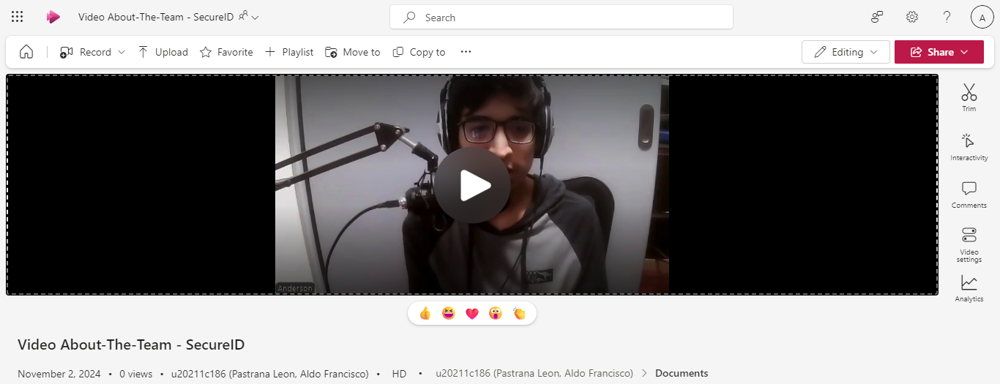
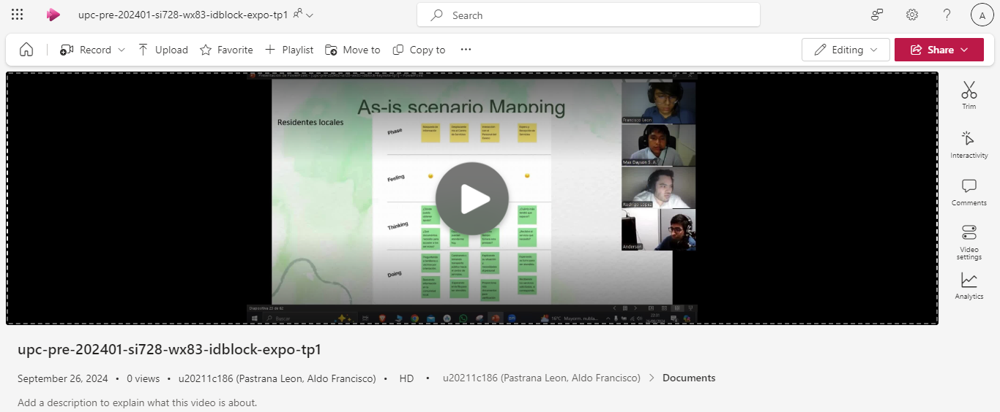
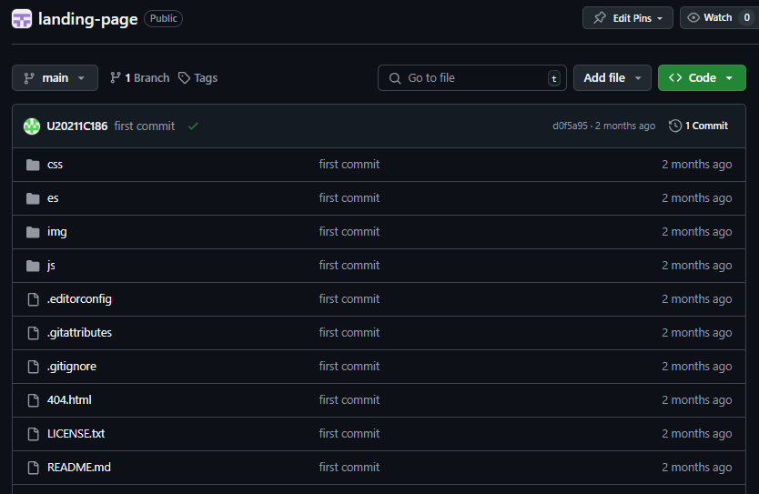
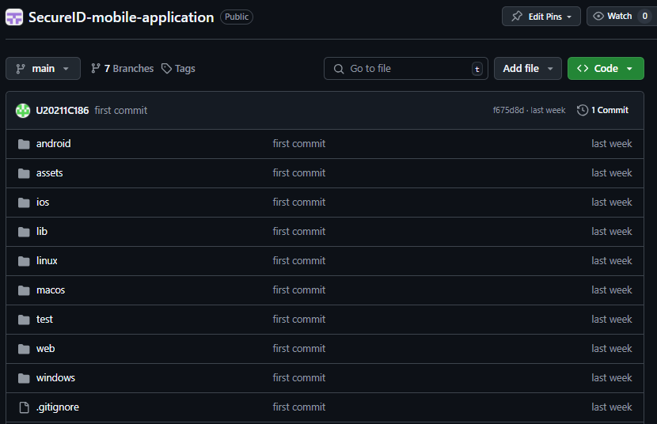
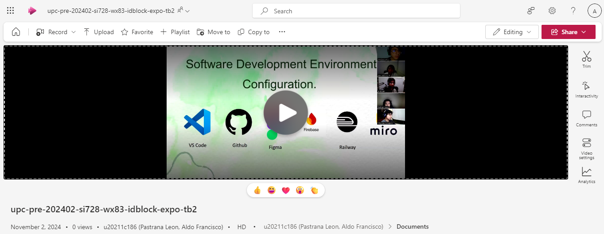
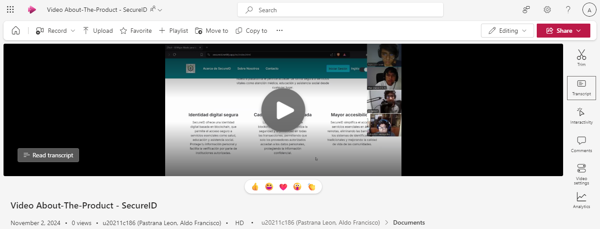

# Avance de Conclusiones, Bibliografía y Anexos
---
**Conclusiones**
- El curso ha demostrado cómo la implementación de procesos de Lean UX, como la formulación de hipótesis, afirmaciones y el uso de Lean UX Canvas, mejora significativamente la comprensión y el desarrollo de soluciones software alineadas con las necesidades reales de los usuarios. Esta integración asegura que los proyectos de software no solo sean técnicamente viables, sino también altamente centrados en el usuario, lo cual es crucial para el éxito comercial de las startups.
- A través de diversas técnicas como entrevistas, análisis competitivo y needfinding, el curso ha equipado a los estudiantes con habilidades esenciales para extraer, analizar y documentar requisitos de manera exhaustiva. Este enfoque sistemático asegura que los estudiantes puedan identificar y priorizar necesidades del usuario final de forma efectiva, un paso fundamental en la creación de software que responde precisamente a los problemas del mercado.
- l curso ha cubierto aspectos avanzados de diseño estratégico y arquitectura de software, incluyendo Domain-Driven Design y Attribute-Driven Design, proporcionando a los estudiantes las competencias para tomar decisiones arquitectónicas informadas que impactan positivamente la calidad y sostenibilidad del software. Estas habilidades son vitales para desarrollar soluciones que sean escalables, mantenibles y seguras.
- La organización en capas, desde el nivel táctico hasta el de diseño UX, refleja una arquitectura de software robusta que facilita la separación de responsabilidades. Cada capa tiene un propósito claro, lo que contribuye a una mayor mantenibilidad y escalabilidad del sistema.
-  El capítulo de diseño UX resalta la importancia de la experiencia del usuario, lo que sugiere que la entrega no solo se enfoca en la funcionalidad del sistema, sino también en cómo los usuarios interactuarán con él, garantizando usabilidad y accesibilidad.
- La inclusión de diagramas a nivel de componentes y base de datos sugiere que se ha trabajado en una documentación técnica detallada, lo que es esencial para el mantenimiento y la continuidad del proyecto.
- La gestión de configuración de software garantiza la coherencia en el entorno de desarrollo, el código fuente y el despliegue, lo que minimiza errores y facilita la colaboración en equipo. Tener configuraciones estandarizadas de desarrollo y estilo de código no solo mejora la productividad, sino que también optimiza la calidad del producto.
- El Sprint 1 permite organizar y documentar cada fase del desarrollo, desde la planificación hasta la evidencia de ejecución y pruebas. Este enfoque iterativo y documentado facilita la evaluación y mejora continua del producto, generando una base sólida para el desarrollo futuro.
- A través de entrevistas y evaluaciones basadas en heurísticas, se obtiene una visión real del valor y usabilidad del producto para el usuario final. Este proceso no solo proporciona un feedback crítico para ajustar la aplicación, sino que también ayuda a identificar mejoras que aumenten la aceptación y efectividad del producto.
- En el video "About-The-Team" de SecureID, los aspectos más destacados incluyen la integración de diversos componentes tecnológicos, como la landing page y la aplicación móvil, un backend convencional y un sistema basado en blockchain. Cada componente fue diseñado para crear y gestionar identidades digitales de forma segura y eficiente, especialmente para personas en zonas rurales del Perú. La landing page y la app móvil ofrecen una interfaz accesible y funcional que permite a los usuarios finales gestionar sus identificaciones digitales y acceder a servicios esenciales, como educación y salud. El backend convencional gestiona la lógica de negocio y la integración con servicios necesarios, mientras que la blockchain privada optimiza la seguridad y la integridad de los datos de identidad, reduciendo el riesgo de fraudes y facilitando el acceso a servicios clave sin depender de documentación convencional.

    

    Link Microsoft Stream: https://upcedupe-my.sharepoint.com/:v:/g/personal/u20211c186_upc_edu_pe/EYV4yHsJANVHniaFRLFlhnQB2leGKrHxhhOGanX82y5_rA?e=pOtYhk

    Link YouTube: https://www.youtube.com/watch?v=ldF-UBWxm7U

        Timing de inicio de cada integrante:

        Pastrana León, Aldo Francisco: 0:06 - 1:19

        Ore Aleman, Anderson Raul: 1:20 - 2:05

        Sabino Arostegui, Max Dayson: 2:06 - 3:27

        López Takahashi, Rodrigo Andrés: 3:28 - 4:28

        Hernandez Tuesta, Sebastian: 4:29 - 5:39

---
**Recomendaciones**
- Sería beneficioso implementar más proyectos grupales que requieran colaboración entre estudiantes de diferentes disciplinas técnicas y de diseño. Esto podría mejorar la aplicación práctica de los principios de Lean UX y Domain-Driven Design, preparando a los estudiantes para los desafíos del entorno laboral real donde el trabajo en equipo interdisciplinar es común.
- Para mantener la relevancia del curso, sería recomendable actualizar continuamente el currículo con estudios de caso recientes que reflejen las últimas tendencias y desafíos en la industria del software. Esto podría incluir más contenido sobre tecnologías emergentes y cómo estas están siendo integradas en las arquitecturas de software modernas.
- Aunque el curso maneja intensivamente aspectos técnicos, agregar un módulo que desarrolle habilidades blandas, como la gestión de proyectos y la comunicación efectiva, podría ser muy valioso. Estas habilidades son esenciales para manejar equipos, presentar ideas y liderar proyectos dentro de empresas tecnológicas y startups.
- Asegúrate de que los diagramas, tanto de la arquitectura de software como de UX, se actualicen continuamente durante el desarrollo, ya que podrían surgir cambios que impacten la estructura inicialmente planteada.
- Implementar pruebas de usabilidad tempranas en el proceso de diseño de UX ayudará a identificar posibles problemas de interacción antes de que se conviertan en un obstáculo durante el desarrollo o despliegue del sistema.
- Fomentar una colaboración estrecha entre los equipos de desarrollo, diseño UX y arquitectura para asegurar que las decisiones tomadas en una capa no afecten negativamente el rendimiento o la experiencia de usuario del sistema final.
- Implementar una configuración de despliegue continua y pruebas automatizadas ayudará a minimizar errores en el despliegue y facilitará la revisión de cada nueva versión. Esto mejorará la eficiencia y calidad en cada entrega de Sprint.
- Asegurarse de que la guía de estilo y convenciones esté clara y accesible para todos los miembros del equipo. Esto unificará el código y facilitará el mantenimiento a largo plazo, además de ser útil para nuevos desarrolladores que se unan al equipo.
- Al realizar entrevistas y evaluaciones, incorporar métricas que midan aspectos clave como la facilidad de uso, la efectividad y el tiempo de aprendizaje. Esto permitirá hacer ajustes basados en datos objetivos y crear un producto más centrado en el usuario.

---
**Video About-the-Team**

Link Microsoft Stream: https://upcedupe-my.sharepoint.com/:v:/g/personal/u20211c186_upc_edu_pe/EYV4yHsJANVHniaFRLFlhnQB2leGKrHxhhOGanX82y5_rA?e=pOtYhk

Link YouTube: https://www.youtube.com/watch?v=ldF-UBWxm7U

    Timing de inicio de cada integrante:

    Pastrana León, Aldo Francisco: 0:06 - 1:19

    Ore Aleman, Anderson Raul: 1:20 - 2:05

    Sabino Arostegui, Max Dayson: 2:06 - 3:27

    López Takahashi, Rodrigo Andrés: 3:28 - 4:28

    Hernandez Tuesta, Sebastian: 4:29 - 5:39

---
**Bibliografía**
- Adzic, G. (2011). Impact mapping: Making a big impact with software products and projects. Provoking Thoughts. Recuperado de https://www.impactmapping.org/book.html
- Aguirre Martens, G. (2023, 25 de octubre). Salud en el Perú: De la cobertura en papel a la cobertura real. América Latina y el Caribe - Blog del Banco Mundial. Recuperado de https://blogs.worldbank.org/es/latinamerica/cobertura-salud-peru
- Cooper, A., Reimann, R., Cronin, D., & Noessel, C. (2014). About face: The essentials of interaction design. John Wiley & Sons. Recuperado de https://fall14se.wordpress.com/wp-content/uploads/2017/04/alan-cooper-robert-reimann-david-cronin-christopher-noessel-about-face_-the-essentials-of-interaction-design-wiley-2014.pdf
- El Peruano. (2021, 21 de agosto). La desigualdad en el Perú. Recuperado de https://elperuano.pe/noticia/127324-la-desigualdad-en-el-peru
- Fowler, M. (2003). Patterns of enterprise application architecture. Addison-Wesley Longman Publishing Co., Inc. Recuperado de https://dl.ebooksworld.ir/motoman/Patterns%20of%20Enterprise%20Application%20Architecture.pdf
- Gothelf, J., & Seiden, J. (2013). Lean UX: Applying lean principles to improve user experience. O'Reilly Media, Inc. Recuperado de https://www.amazon.com/Lean-UX-Applying-Principles-Experience/dp/1449311652
- Kim, G. J. (2015). Designing virtual reality systems: The structured approach. Springer. Recuperado de https://link.springer.com/book/10.1007/978-1-84628-230-0
- Ministerio de Transportes y Comunicaciones. (2023). Innovar para conectar: Estrategias y medidas de regulación inteligente para reducir la brecha digital. Recuperado de https://cdn.www.gob.pe/uploads/document/file/4341442/Innovar%20para%20conectar.pdf
- Patton, J. (2014). User story mapping: Discover the whole story, build the right product. O'Reilly Media, Inc. Recuperado de https://www.amazon.com/User-Story-Mapping-Discover-Product/dp/1491904909
- Podeswa, H. (2009). The business analyst's handbook. Cengage Learning. Recuperado de https://www.amazon.com/Business-Analysts-Handbook-Howard-Podeswa/dp/1598635654
- Rubin, K. S. (2012). Essential Scrum: A practical guide to the most popular Agile process. Addison-Wesley. Recuperado de https://libdoc.dpu.ac.th/eBook/113642.pdf
- Unidad Latina. (2024, 11 de abril). Comunidades rurales: Acceso a la tecnología. Recuperado de https://unidadlatina.org/tecnologia/tecnologia-en-comunidades-rurales/
- Vernon, V. (2013). Implementing domain-driven design. Addison-Wesley. Recuperado de https://dl.ebooksworld.ir/motoman/AW.Implementing.Domain-Driven.Design.www.EBooksWorld.ir.pdf
- Young, A. (2017). EventStorming: An act of deliberate collective learning. Leanpub. Recuperado de https://www.eventstorming.com/book/

---
**Anexos**

- **TB1**

---

[Anexo C4 Model](https://c4model.com/)

---

[Lean UX Process](https://link.springer.com/chapter/10.1007/978-3-030-58817-5_37)

---

[Needfinding](https://www.cambridge.org/core/journals/proceedings-of-the-design-society/article/needfinding-practice-enhancing-students-problem-framing-skills-through-iterative-observation-for-business-innovation/62607D2BB63421821769202E85BA6DCA)

---

[User Stories](https://link.springer.com/chapter/10.1007/978-3-319-30282-9_14)

---

[EventStorming](https://d1wqtxts1xzle7.cloudfront.net/59311660/Event_Storming_Case_Studies20190519-70833-1rtyiru-libre.pdf?1558264829=&response-content-disposition=inline%3B+filename%3DIntroducing_EventStorming_An_act_of_Deli.pdf&Expires=1719486406&Signature=goFX~KXlwLGqUrkm4nigVK7QIvlMN~U5Ayzr18djq7bITp6LtYmIqaKlogw4SuMkH1fNHenSdCyHHqie2W9wKvxK1kc0kNGfp-Gaf7aQgdE-ejHbSWKZsPOcJkvt9g4uYJx8u8LmoDFGAfmsyF0mtTXJkDbqAmLvb4d-wbrIV2T6i~V06-yMnZXw4iz5t6w6b0MeQiYF4LhGPd8KQbqGKmkk-~DXOSeEvfjzPRnOXGcveMWJWyATr9KKC47JtgUC3kR59P4oWx4e-l~tj8xwAuVJjirWCBIencguF3FU~wR32dBkV4jnUk0fABgNlWKO4u7rEtfJTK7Vovvrp5rrgQ__&Key-Pair-Id=APKAJLOHF5GGSLRBV4ZA)

---

[Project Report GitHub](https://github.com/IDBlock-WX83/SecureID-reports)

---

[Lean UX Canvas](https://miro.com/welcomeonboard/SXh4SWJrRVd6RW5VSHpBbFRFdWx5NTJIMFZyY1FnU21yaTNSUlU3aE5yT0hqNHZSN2dOczdXV3FMcFlGcDBHT3wzNDU4NzY0NTYyODY2NDM1MDk4fDI=?share_link_id=430777082355)

---

[EventStorming](https://miro.com/app/board/uXjVKjwtUkA=/?share_link_id=781413633439)

---

[Domain Message Flows Modeling](https://miro.com/app/board/uXjVM6QV_5Q=/?share_link_id=720006541665)

---

[Bounded Context Canvases](https://miro.com/app/board/uXjVM6QV_5Q=/?share_link_id=391390025740)

---

[Context Mapping](https://miro.com/app/board/uXjVKjwtUkA=/?share_link_id=864873335225)

---

[Registro de Entrevistas](https://upcedupe-my.sharepoint.com/:v:/g/personal/u20211c186_upc_edu_pe/EdFBEmWyZMNNvyPcjHQ5mlIBomxvcuanNdfn_DJd41cYSQ?e=Rhbwcd)

---

[Video de exposición TB1](https://upcedupe-my.sharepoint.com/:f:/g/personal/u20211c186_upc_edu_pe/EgSXpnD5IhFPpEiI0nct0XYBosu1bOh_ZrYg318WLZqdog?e=DPihWg)

- **TP1**

---

[Landing Page - Wireframes - Mock-ups](https://www.figma.com/design/wW9tsqZq7kXYhC3lryzsVY/Landing-Page-UI-Desing?node-id=0-1&t=C3wwrKhCw9JGU2Vj-1)

---

[Landing Page Desplegado](https://secureid.netlify.app/index.html)

---

[App Mobile - Wireframes - Mock-ups](https://www.figma.com/design/66fO5Iskayzuy5JR6wPjyu/Wireframes?node-id=18-12&t=Zco6JaYDhpdq4iat-1)

---

[Video de exposición TP1](https://upcedupe-my.sharepoint.com/:v:/g/personal/u20211c186_upc_edu_pe/EUA1kyu5qQ1OqkzFc_w6NwgBlyfluHGEn_jfDzwYx6fymA?e=V0HVaw)

- **TB2**

---

[Landing Page GitHub](https://github.com/IDBlock-WX83/SecureID-reports)

---

[Mobile Application GitHub](https://github.com/IDBlock-WX83/SecureID-reports)

---

[Video de exposición TB2](https://upcedupe-my.sharepoint.com/:v:/g/personal/u20211c186_upc_edu_pe/EV462_lRakdAm1F8bWWd93MBTW9KuzkVY7TIlw0tZ3-oKw?e=mVL2Wv)

---

[Video About-The-Product](https://upcedupe-my.sharepoint.com/:v:/g/personal/u20211c186_upc_edu_pe/ETW2rJLI7nFLo2tie-p6iasBBMsJQvLLlETa5hUlRAhFXg?e=SSmdTu)

    Timing de inicio de cada integrante:

    Pastrana León, Aldo Francisco: 0:02 - 0:41

    Ore Aleman, Anderson Raul: 0:42 - 1:20

    Sabino Arostegui, Max Dayson: 1:21 - 2:06

    López Takahashi, Rodrigo Andrés: 2:07 - 2:44

    Hernandez Tuesta, Sebastian: 2:45 - 3:13

---

[Video About-The-Theam](https://upcedupe-my.sharepoint.com/:v:/g/personal/u20211c186_upc_edu_pe/EYV4yHsJANVHniaFRLFlhnQB2leGKrHxhhOGanX82y5_rA?e=UgJE8w)

    Timing de inicio de cada integrante:

    Pastrana León, Aldo Francisco: 0:06 - 1:19

    Ore Aleman, Anderson Raul: 1:20 - 2:05

    Sabino Arostegui, Max Dayson: 2:06 - 3:27

    López Takahashi, Rodrigo Andrés: 3:28 - 4:28

    Hernandez Tuesta, Sebastian: 4:29 - 5:39
